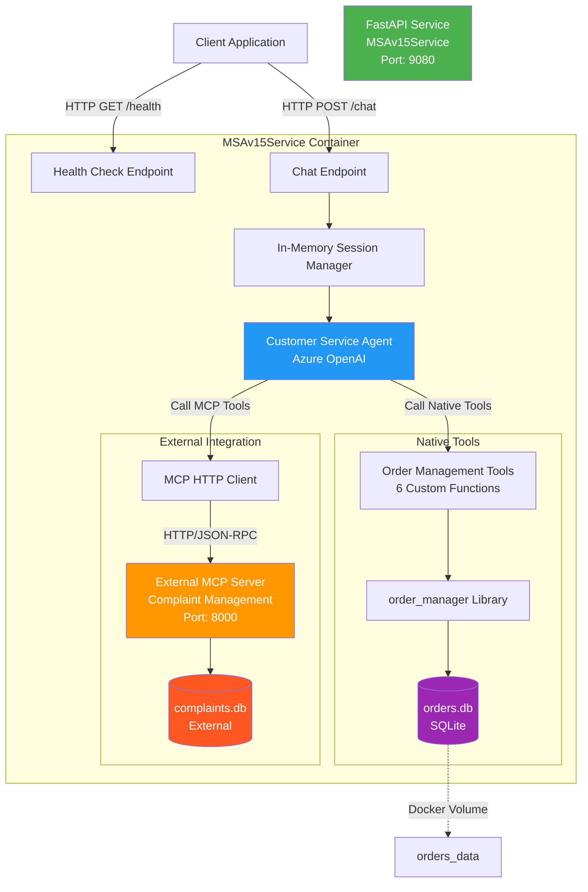
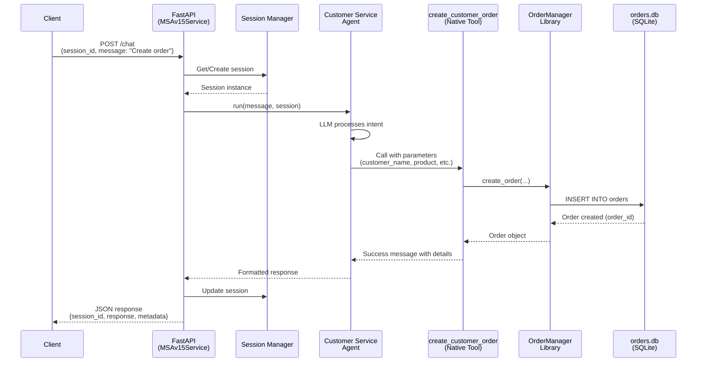
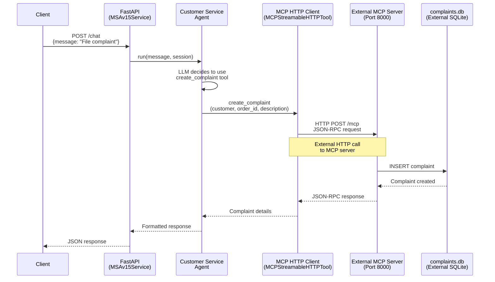
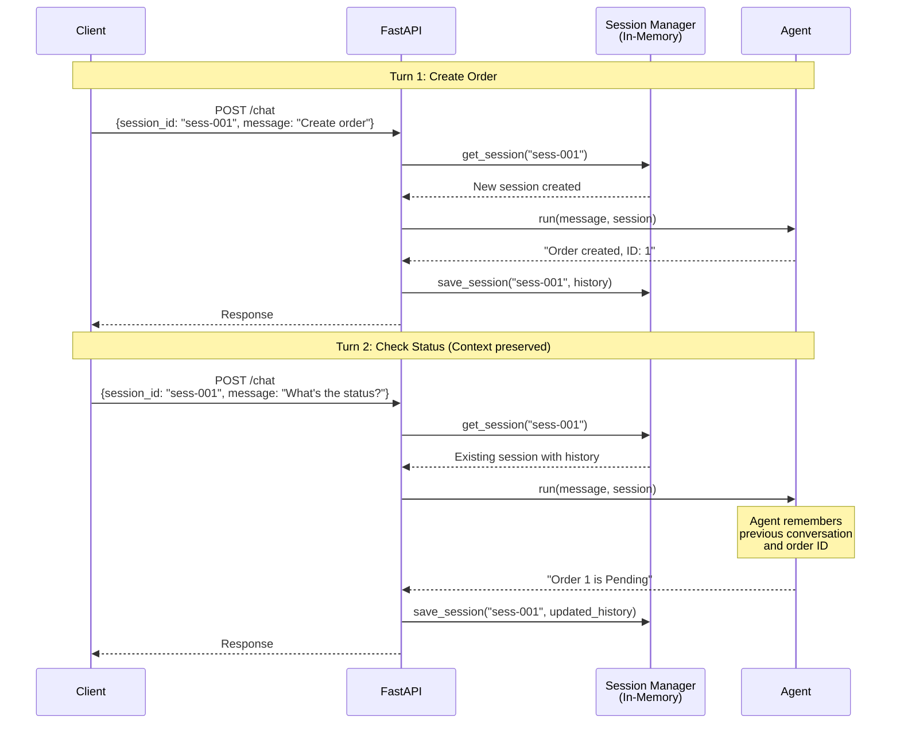
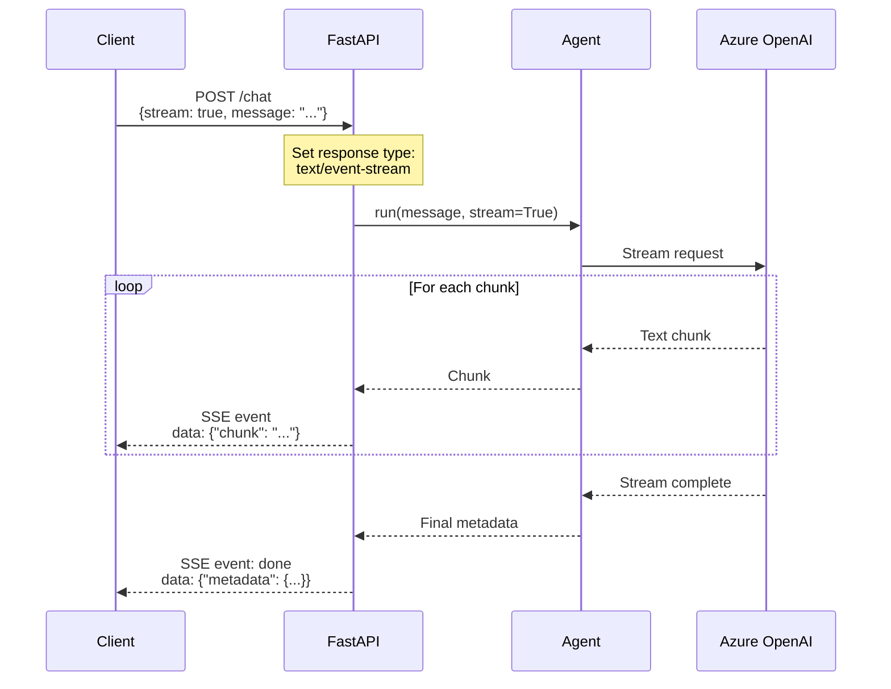
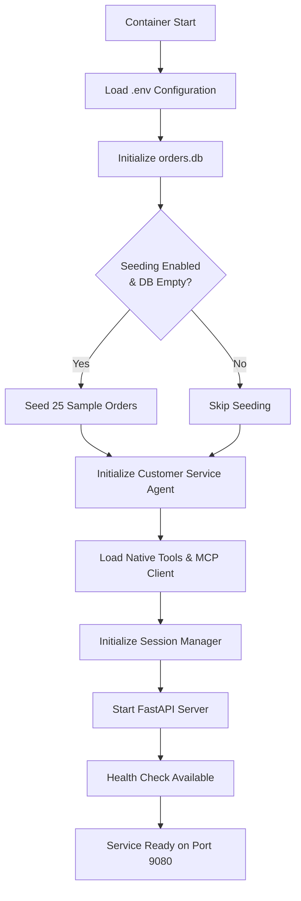

# Product Specification Document (PSD)
## MSAv15Service - Customer Service Agent REST API

**Version:** 0.1.0  
**Product Manager:** Ramkumar (Ram)  
**Development Team:** CAP (Chandini, Ashok, Priya)  
**Date:** February 19, 2026  
**Status:** Draft

---

## 1. Executive Summary

MSAv15Service exposes the Customer Service Agent (built with Microsoft Agent Framework) as a REST API service. The agent handles both order management and complaint management through a unified conversational interface, combining native Python tools and external MCP servers.

### Key Features
- 🤖 **Conversational AI Agent** - Multi-turn conversation support with session management
- 📦 **Order Management** - Native Python tools for order operations
- 📋 **Complaint Management** - Integration with external MCP servers
- 🔄 **Streaming Support** - Optional streaming responses for real-time interaction
- 🐳 **Containerized** - Docker-ready with volumes for data persistence
- 📊 **Auto-seeding** - Configurable database initialization with sample data

---

## 2. Technical Stack

| Component | Technology | Version |
|-----------|-----------|---------|
| **Runtime** | Python | 3.12 |
| **Web Framework** | FastAPI | Latest |
| **AI Framework** | Microsoft Agent Framework | Latest |
| **Database** | SQLite | 3.x |
| **Containerization** | Docker | Latest |
| **Orchestration** | Docker Compose | Latest (no version in compose file) |
| **License** | MIT | - |

---

## 3. Architecture Overview



---

## 4. System Components

### 4.1 Core Components

| Component | Description | Responsibility |
|-----------|-------------|----------------|
| **FastAPI Application** | REST API server | HTTP request handling, routing, CORS, rate limiting |
| **Session Manager** | In-memory session store | Manages conversation sessions, keyed by session_id |
| **Customer Service Agent** | MAF Agent instance | Orchestrates tools, handles AI interactions |
| **Order Manager Library** | Python library | CRUD operations for orders (SQLite backend) |
| **MCP HTTP Client** | MCPStreamableHTTPTool | Communicates with external MCP complaint server |

### 4.2 Data Storage

| Database | Type | Purpose | Persistence |
|----------|------|---------|-------------|
| **orders.db** | SQLite | Order management data | Docker volume: `orders_data` |
| **complaints.db** | SQLite | Complaint data (external) | Managed by MCP server team |

---

## 5. API Specification

### 5.1 Base Configuration

```
Service Name: MSAv15Service
Port: 9080
Base URL: http://localhost:9080
CORS: Allow all origins (*)
Rate Limiting: Disabled by default (configurable via .env)
```

### 5.2 Endpoints

#### 5.2.1 Health Check Endpoint

**GET** `/health`

**Description:** Service health status check

**Response:**
```json
{
  "status": "healthy",
  "service": "MSAv15Service",
  "version": "0.1.0",
  "timestamp": "2026-02-19T10:30:00Z",
  "dependencies": {
    "database": "connected",
    "mcp_server": "reachable"
  }
}
```

**Status Codes:**
- `200 OK` - Service is healthy
- `503 Service Unavailable` - Service has issues

---

#### 5.2.2 Chat Endpoint

**POST** `/chat`

**Description:** Conversational interface to the customer service agent. Supports multi-turn conversations with optional streaming.

**Request Headers:**
```
Content-Type: application/json
Accept: application/json OR text/event-stream (for streaming)
```

**Request Body:**
```json
{
  "session_id": "string (optional, auto-generated if not provided)",
  "message": "string (required)",
  "stream": false
}
```

**Response (Non-Streaming):**
```json
{
  "session_id": "uuid-string",
  "response": "Agent's text response",
  "timestamp": "2026-02-19T10:30:00Z",
  "metadata": {
    "turn_count": 1,
    "tools_used": ["create_customer_order"],
    "tokens_used": 450
  }
}
```

**Response (Streaming - SSE):**
```
event: message
data: {"chunk": "Hello! ", "session_id": "uuid"}

event: message
data: {"chunk": "I've created ", "session_id": "uuid"}

event: message
data: {"chunk": "your order.", "session_id": "uuid"}

event: done
data: {"session_id": "uuid", "metadata": {...}}
```

**Status Codes:**
- `200 OK` - Request successful
- `400 Bad Request` - Invalid request format
- `500 Internal Server Error` - Server error
- `429 Too Many Requests` - Rate limit exceeded (if enabled)

**Example Requests:**

```bash
# Non-streaming request
curl -X POST http://localhost:9080/chat \
  -H "Content-Type: application/json" \
  -d '{
    "session_id": "customer-123",
    "message": "I want to place an order for a laptop",
    "stream": false
  }'

# Streaming request
curl -X POST http://localhost:9080/chat \
  -H "Content-Type: application/json" \
  -H "Accept: text/event-stream" \
  -d '{
    "session_id": "customer-123",
    "message": "Show me my orders",
    "stream": true
  }'
```

---

### 5.3 OpenAPI/Swagger Documentation

**URL:** `http://localhost:9080/docs`  
**ReDoc URL:** `http://localhost:9080/redoc`

Auto-generated interactive API documentation using FastAPI's built-in Swagger UI.

---

## 6. Sequence Diagrams

### 6.1 Order Creation Flow



---

### 6.2 Complaint Creation Flow (MCP Integration)



---

### 6.3 Multi-Turn Conversation Flow



---

### 6.4 Streaming Response Flow



---

## 7. Component Interaction Matrix

| Component | Interacts With | Protocol | Purpose |
|-----------|---------------|----------|---------|
| FastAPI | Client | HTTP/REST | API requests |
| FastAPI | Session Manager | In-Process | Session CRUD |
| Session Manager | Agent | In-Process | Pass session context |
| Agent | Order Tools | Function Call | Execute order operations |
| Agent | MCP Client | In-Process | Trigger MCP tool |
| Order Tools | order_manager | Python Import | Library functions |
| order_manager | orders.db | SQLite | Database operations |
| MCP Client | MCP Server | HTTP/JSON-RPC | Remote tool execution |
| MCP Server | complaints.db | SQLite | Complaint data (external) |

---

## 8. Configuration Management

### 8.1 Environment Variables (.env)

```env
# Service Configuration
SERVICE_NAME=MSAv15Service
SERVICE_VERSION=0.1.0
SERVICE_PORT=9080

# Azure OpenAI Configuration
AZURE_AI_PROJECT_ENDPOINT=https://your-project.openai.azure.com
AZURE_OPENAI_RESPONSES_DEPLOYMENT_NAME=gpt-4
AZURE_OPENAI_API_KEY=your-key-here

# Database Configuration
ORDER_DB_PATH=./data/orders.db
ORDER_DB_SEEDING_ENABLED=true
ORDER_DB_SEED_COUNT=25

# MCP Server Configuration (External)
MCP_COMPLAINT_SERVER_URL=http://localhost:8000/mcp

# API Configuration
CORS_ALLOW_ORIGINS=*
RATE_LIMITING_ENABLED=false
RATE_LIMIT_REQUESTS_PER_MINUTE=60

# Logging
LOG_LEVEL=INFO
```

### 8.2 Configuration Rules

| Setting | Default | Description |
|---------|---------|-------------|
| `SERVICE_PORT` | `9080` | API service port |
| `ORDER_DB_SEEDING_ENABLED` | `true` | Enable/disable auto-seeding |
| `ORDER_DB_SEED_COUNT` | `25` | Number of sample orders to seed |
| `CORS_ALLOW_ORIGINS` | `*` | CORS allowed origins |
| `RATE_LIMITING_ENABLED` | `false` | Enable/disable rate limiting |
| `RATE_LIMIT_REQUESTS_PER_MINUTE` | `60` | Max requests per minute (when enabled) |

**Seeding Behavior:**
- Seeds only if database is empty (no existing records)
- If `ORDER_DB_SEEDING_ENABLED=false`, skips seeding entirely
- Uses predefined sample data (see Section 9)

---

## 9. Sample Data Structure

### 9.1 Order Sample Records (4-5 Examples)

```python
# Sample data for seeding (25 total, showing 5 examples)

SEED_ORDERS = [
    {
        "order_date": "2026-02-15T10:30:00",
        "customer_name": "John Smith",
        "billing_address": "123 George Street, Sydney, NSW 2000, Australia",
        "product_sku": "LAPTOP-HP-001",
        "quantity": 1,
        "order_amount": 249900,  # $2,499.00 in cents
        "order_status": "Delivered",
        "remarks": "Gift wrapped"
    },
    {
        "order_date": "2026-02-16T14:20:00",
        "customer_name": "Sarah Johnson",
        "billing_address": "456 Collins St, Melbourne, VIC 3000, Australia",
        "product_sku": "MONITOR-DELL-24",
        "quantity": 2,
        "order_amount": 79900,  # $799.00 in cents
        "order_status": "Shipped",
        "remarks": None
    },
    {
        "order_date": "2026-02-17T09:15:00",
        "customer_name": "Michael Chen",
        "billing_address": "789 Queen St, Brisbane, QLD 4000, Australia",
        "product_sku": "KEYBOARD-LOGITECH",
        "quantity": 1,
        "order_amount": 12900,  # $129.00 in cents
        "order_status": "Pending",
        "remarks": "Urgent delivery requested"
    },
    {
        "order_date": "2026-02-18T16:45:00",
        "customer_name": "Emma Wilson",
        "billing_address": "321 King William St, Adelaide, SA 5000, Australia",
        "product_sku": "MOUSE-RAZER-PRO",
        "quantity": 3,
        "order_amount": 26900,  # $269.00 in cents
        "order_status": "Processing",
        "remarks": "Corporate purchase"
    },
    {
        "order_date": "2026-02-19T08:00:00",
        "customer_name": "Ramkumar Sundaram",
        "billing_address": "555 St Georges Terrace, Perth, WA 6000, Australia",
        "product_sku": "LAPTOP-LENOVO-X1",
        "quantity": 1,
        "order_amount": 289900,  # $2,899.00 in cents
        "order_status": "Confirmed",
        "remarks": "Include extended warranty"
    }
    # ... 20 more records with varied products, statuses, locations
]
```

### 9.2 Product SKUs Reference

| Product SKU | Description | Typical Price |
|-------------|-------------|---------------|
| LAPTOP-HP-001 | HP EliteBook 840 G9 | $2,499.00 |
| LAPTOP-LENOVO-X1 | Lenovo ThinkPad X1 Carbon | $2,899.00 |
| LAPTOP-DELL-XPS | Dell XPS 13 | $2,199.00 |
| MONITOR-DELL-24 | Dell UltraSharp 24" | $399.50 |
| MONITOR-LG-27 | LG 27" 4K Monitor | $549.00 |
| KEYBOARD-LOGITECH | Logitech MX Keys | $129.00 |
| MOUSE-RAZER-PRO | Razer Pro Click | $89.00 |
| HEADSET-SONY-WH | Sony WH-1000XM5 | $449.00 |

### 9.3 Order Status Values

```python
VALID_STATUSES = [
    "Pending",      # Initial state
    "Processing",   # Being prepared
    "Confirmed",    # Payment confirmed
    "Shipped",      # In transit
    "Delivered",    # Completed
    "Cancelled",    # Cancelled by customer
    "Returned"      # Returned after delivery
]
```

---

## 10. Project Structure

```
v15-e2e-casestudy/
├── api-service/                    # NEW: REST API Service
│   ├── app/
│   │   ├── __init__.py
│   │   ├── main.py                # FastAPI application entry point
│   │   ├── config.py              # Configuration management
│   │   ├── models.py              # Pydantic models for API
│   │   ├── schemas.py             # Request/Response schemas
│   │   ├── routers/
│   │   │   ├── __init__.py
│   │   │   ├── chat.py           # /chat endpoint
│   │   │   └── health.py         # /health endpoint
│   │   ├── services/
│   │   │   ├── __init__.py
│   │   │   ├── agent_service.py  # Agent initialization
│   │   │   ├── session_manager.py # In-memory session store
│   │   │   └── seeding_service.py # Database seeding
│   │   ├── middleware/
│   │   │   ├── __init__.py
│   │   │   ├── cors.py           # CORS configuration
│   │   │   └── rate_limit.py     # Rate limiting (optional)
│   │   └── utils/
│   │       ├── __init__.py
│   │       └── logger.py         # Logging configuration
│   ├── data/                     # Data directory (Docker volume mount)
│   │   └── orders.db            # Created at runtime
│   ├── tests/
│   │   ├── __init__.py
│   │   ├── test_chat.py
│   │   └── test_health.py
│   ├── .env.example              # Example environment variables
│   ├── .gitignore
│   ├── Dockerfile                # Slim Python 3.12 image
│   ├── docker-compose.yml        # No version field
│   ├── requirements.txt          # Python dependencies
│   ├── README.md
│   ├── CONTRIBUTING.md
│   ├── CHANGELOG.md
│   └── LICENSE                   # MIT License
│
├── back-end/
│   ├── libraries/
│   │   └── order_manager/        # Existing order management library
│   └── experiments/
│       └── e2e-order-complaint-agent.ipynb  # Original notebook
│
├── mcp-servers/                   # External MCP server (separate team)
│   └── ...                       # Not included in this service
│
└── docs/
    └── PRODUCT-SPECIFICATION.md  # This document
```

---

## 11. Docker Configuration

### 11.1 Dockerfile (Slim Image)

**Key Requirements:**
- Base image: `python:3.12-slim`
- Optimize layers for caching
- Non-root user for security
- Health check included

**Expected Structure:**
```dockerfile
FROM python:3.12-slim

# Set working directory
WORKDIR /app

# Install dependencies first (for caching)
COPY requirements.txt .
RUN pip install --no-cache-dir -r requirements.txt

# Copy application code
COPY app/ ./app/

# Create data directory
RUN mkdir -p /app/data

# Create non-root user
RUN useradd -m -u 1000 appuser && chown -R appuser:appuser /app
USER appuser

# Expose port
EXPOSE 9080

# Health check
HEALTHCHECK --interval=30s --timeout=3s --start-period=5s --retries=3 \
  CMD curl -f http://localhost:9080/health || exit 1

# Run application
CMD ["uvicorn", "app.main:app", "--host", "0.0.0.0", "--port", "9080"]
```

### 11.2 Docker Compose (No Version Field)

**Key Requirements:**
- No `version:` field (modern Compose format)
- Named volume for database persistence
- Environment variables from `.env`
- Health check configuration

**Expected Structure:**
```yaml
services:
  msav15-service:
    build: .
    container_name: msav15-service
    ports:
      - "9080:9080"
    volumes:
      - orders_data:/app/data
    environment:
      - SERVICE_NAME=${SERVICE_NAME}
      - SERVICE_VERSION=${SERVICE_VERSION}
      - SERVICE_PORT=${SERVICE_PORT}
      - AZURE_AI_PROJECT_ENDPOINT=${AZURE_AI_PROJECT_ENDPOINT}
      - AZURE_OPENAI_RESPONSES_DEPLOYMENT_NAME=${AZURE_OPENAI_RESPONSES_DEPLOYMENT_NAME}
      - ORDER_DB_SEEDING_ENABLED=${ORDER_DB_SEEDING_ENABLED}
      - ORDER_DB_SEED_COUNT=${ORDER_DB_SEED_COUNT}
      - MCP_COMPLAINT_SERVER_URL=${MCP_COMPLAINT_SERVER_URL}
      - CORS_ALLOW_ORIGINS=${CORS_ALLOW_ORIGINS}
      - RATE_LIMITING_ENABLED=${RATE_LIMITING_ENABLED}
    env_file:
      - .env
    healthcheck:
      test: ["CMD", "curl", "-f", "http://localhost:9080/health"]
      interval: 30s
      timeout: 3s
      retries: 3
      start_period: 10s
    restart: unless-stopped

volumes:
  orders_data:
    driver: local
```

---

## 12. Supporting Documentation

### 12.1 README.md - Key Sections

```markdown
# MSAv15Service - Customer Service Agent API

REST API service exposing an AI-powered customer service agent.

## Quick Start

### Prerequisites
- Docker & Docker Compose
- Azure OpenAI credentials
- External MCP server running at http://localhost:8000

### Installation
1. Clone repository
2. Copy .env.example to .env
3. Configure Azure OpenAI credentials
4. Run: docker-compose up

### Usage
- API: http://localhost:9080
- Docs: http://localhost:9080/docs
- Health: http://localhost:9080/health

## Architecture
[Include diagram from Section 3]

## API Reference
[Link to Section 5 or Swagger docs]
```

### 12.2 CONTRIBUTING.md - Team Guidelines

```markdown
# Contributing to MSAv15Service

## Team
- **Product Manager:** Ramkumar (Ram)
- **Development Team (CAP):**
  - Chandini
  - Ashok
  - Priya

## Development Workflow
1. Create feature branch from `main`
2. Make changes with clear commit messages
3. Write/update tests
4. Update CHANGELOG.md
5. Create PR for team review
6. Merge after approval

## Code Standards
- Python 3.12+ features encouraged
- Type hints required
- FastAPI best practices
- SQLite for data persistence

## Testing
```bash
pytest tests/
```

## Local Development
```bash
# Install dependencies
pip install -r requirements.txt

# Run locally
uvicorn app.main:app --reload --port 9080
```
```

### 12.3 CHANGELOG.md - Version Tracking

```markdown
# Changelog

All notable changes to MSAv15Service will be documented here.

## [0.1.0] - 2026-02-19

### Added
- Initial release of MSAv15Service
- POST /chat endpoint with streaming support
- GET /health endpoint with dependency checks
- In-memory session management
- Customer service agent integration (MAF)
- Order management tools (6 native functions)
- MCP complaint management integration
- Auto-seeding with 25 sample orders
- Docker and Docker Compose configuration
- CORS support (all origins)
- Optional rate limiting
- OpenAPI/Swagger documentation
- MIT License

### Technical Details
- Python 3.12
- FastAPI framework
- SQLite database with Docker volumes
- Slim Docker image optimization
```

### 12.4 .gitignore

```gitignore
# Python
__pycache__/
*.py[cod]
*$py.class
*.so
.Python
env/
venv/
ENV/
.venv

# Environment
.env
.env.local

# Database
*.db
*.sqlite
*.sqlite3
data/

# IDE
.vscode/
.idea/
*.swp
*.swo

# Testing
.pytest_cache/
.coverage
htmlcov/

# Docker
.docker/

# Logs
*.log
logs/

# OS
.DS_Store
Thumbs.db
```

### 12.5 LICENSE (MIT)

```
MIT License

Copyright (c) 2026 Ramkumar

Permission is hereby granted, free of charge, to any person obtaining a copy
of this software and associated documentation files (the "Software"), to deal
in the Software without restriction, including without limitation the rights
to use, copy, modify, merge, publish, distribute, sublicense, and/or sell
copies of the Software, and to permit persons to whom the Software is
furnished to do so, subject to the following conditions:

The above copyright notice and this permission notice shall be included in all
copies or substantial portions of the Software.

THE SOFTWARE IS PROVIDED "AS IS", WITHOUT WARRANTY OF ANY KIND, EXPRESS OR
IMPLIED, INCLUDING BUT NOT LIMITED TO THE WARRANTIES OF MERCHANTABILITY,
FITNESS FOR A PARTICULAR PURPOSE AND NONINFRINGEMENT. IN NO EVENT SHALL THE
AUTHORS OR COPYRIGHT HOLDERS BE LIABLE FOR ANY CLAIM, DAMAGES OR OTHER
LIABILITY, WHETHER IN AN ACTION OF CONTRACT, TORT OR OTHERWISE, ARISING FROM,
OUT OF OR IN CONNECTION WITH THE SOFTWARE OR THE USE OR OTHER DEALINGS IN THE
SOFTWARE.
```

---

## 13. Dependencies

### 13.1 Python Requirements (requirements.txt)

```txt
# Web Framework
fastapi>=0.109.0
uvicorn[standard]>=0.27.0
pydantic>=2.5.0
pydantic-settings>=2.1.0

# Microsoft Agent Framework
agent-framework
azure-ai-projects
azure-identity

# Database
sqlalchemy>=2.0.0

# Utilities
python-dotenv>=1.0.0
python-multipart>=0.0.6

# CORS & Middleware
slowapi>=0.1.9  # For rate limiting (optional)

# Logging
structlog>=24.1.0

# Testing (dev)
pytest>=7.4.0
pytest-asyncio>=0.21.0
httpx>=0.25.0

# Order Manager Library (local)
# Note: Reference from ../back-end/libraries/order_manager
```

---

## 14. Metadata Configuration

```python
# app/main.py - Service metadata

app = FastAPI(
    title="MSAv15Service",
    description="Customer Service Agent REST API - Multi-turn conversational AI for order and complaint management",
    version="0.1.0",
    contact={
        "name": "Ramkumar",
        "email": "ram@example.com"
    },
    license_info={
        "name": "MIT License",
        "url": "https://opensource.org/licenses/MIT"
    },
    docs_url="/docs",
    redoc_url="/redoc",
    openapi_url="/openapi.json"
)
```

---

## 15. Deployment Considerations

### 15.1 External Dependencies

| Dependency | Responsibility | Status |
|-----------|---------------|--------|
| **MCP Complaint Server** | External team | Must be running at configured URL |
| **Azure OpenAI** | Cloud service | Requires valid credentials |
| **Docker** | Infrastructure | Required for containerization |

### 15.2 Startup Sequence



### 15.3 Health Check Details

The `/health` endpoint verifies:
1. **Service Status** - FastAPI server running
2. **Database Connection** - orders.db accessible
3. **MCP Server Reachability** - HTTP HEAD request to MCP server URL

---

## 16. Development Phases

### Phase 1 - Core Implementation (CAP Team)
- [ ] Setup FastAPI application structure
- [ ] Implement `/health` endpoint
- [ ] Implement `/chat` endpoint (non-streaming)
- [ ] Create session manager (in-memory)
- [ ] Initialize agent with native tools
- [ ] Add MCP client integration
- [ ] Database seeding service

### Phase 2 - Advanced Features
- [ ] Streaming support for `/chat`
- [ ] Rate limiting implementation
- [ ] Enhanced error handling
- [ ] Comprehensive logging

### Phase 3 - Containerization
- [ ] Create Dockerfile (slim image)
- [ ] Docker compose configuration
- [ ] Volume management
- [ ] Health checks

### Phase 4 - Documentation & Testing
- [ ] Unit tests for all endpoints
- [ ] Integration tests
- [ ] API documentation (Swagger)
- [ ] README, CONTRIBUTING, CHANGELOG

---

## 17. Success Criteria

| Criterion | Target | Measurement |
|-----------|--------|-------------|
| **API Response Time** | < 2s (non-streaming) | Average response time |
| **Startup Time** | < 30s | Time to first healthy response |
| **Session Management** | 1000+ concurrent sessions | Memory usage monitoring |
| **Database Seeding** | 25 records < 5s | Seeding execution time |
| **Health Check** | < 100ms | Health endpoint response |
| **Container Size** | < 500MB | Docker image size |
| **Test Coverage** | > 80% | pytest coverage report |

---

## 18. Risk Assessment

| Risk | Impact | Mitigation |
|------|--------|------------|
| MCP server unavailable | High | Health check detects, graceful error handling |
| Azure OpenAI quota exceeded | High | Rate limiting, retry logic, fallback messages |
| Memory leak in session store | Medium | Session TTL, periodic cleanup |
| Database volume corruption | Medium | Regular backups, volume redundancy |
| Container crashes | Medium | Restart policy, health checks |

---

## 19. Future Enhancements (Post v0.1.0)

- 🔐 API key authentication
- 📊 Logging and monitoring (Prometheus/Grafana)
- 💾 Redis for distributed session storage
- 🔄 WebSocket support for real-time chat
- 📈 Analytics dashboard
- 🌍 Multi-language support
- 🧪 Load testing and performance optimization
- 📱 Mobile SDK

---

## 20. References

| Document | Location |
|----------|----------|
| **Original Notebook** | `back-end/experiments/e2e-order-complaint-agent.ipynb` |
| **Order Manager Library** | `back-end/libraries/order_manager/` |
| **MCP Server Docs** | External team documentation |
| **Microsoft Agent Framework** | [Official Docs](https://microsoft.github.io/agent-framework/) |
| **FastAPI Documentation** | [fastapi.tiangolo.com](https://fastapi.tiangolo.com) |

---

## Approval & Sign-off

**Product Manager:** Ramkumar (Ram)  
**Date:** _____________  
**Signature:** _____________

**Development Team Lead (CAP):**  
**Date:** _____________  
**Signature:** _____________

---

**Document Version:** 1.0  
**Last Updated:** February 19, 2026  
**Next Review:** March 2026

---

*End of Product Specification Document*
