# Complaint Management MCP Server - Technical Architecture & Implementation Guide

**Version:** 1.0.0  
**Date:** February 18, 2026  
**Document Type:** Technical Architecture & Implementation Guide  
**Author:** GitHub Copilot  
**Reviewers:** Ramkumar, Chandini, Priya, Ashok

---

## Table of Contents

1. [System Architecture Overview](#1-system-architecture-overview)
2. [Component Architecture](#2-component-architecture)
3. [Data Architecture](#3-data-architecture)
4. [Application Flow Architecture](#4-application-flow-architecture)
5. [MCP Tools Architecture](#5-mcp-tools-architecture)
6. [Database Design & Schema](#6-database-design--schema)
7. [Sequence Diagrams](#7-sequence-diagrams)
8. [Class Design](#8-class-design)
9. [Configuration Architecture](#9-configuration-architecture)
10. [Error Handling Architecture](#10-error-handling-architecture)
11. [Logging Architecture](#11-logging-architecture)
12. [Deployment Architecture](#12-deployment-architecture)
13. [Security Considerations](#13-security-considerations)
14. [Performance Optimization](#14-performance-optimization)
15. [Implementation Patterns](#15-implementation-patterns)

---

## 1. System Architecture Overview

### 1.1 High-Level Architecture

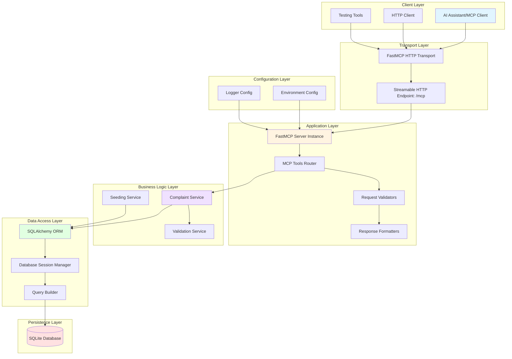
```mermaid
graph TB
    subgraph "Client Layer"
        A[AI Assistant/MCP Client]
        B[HTTP Client]
        C[Testing Tools]
    end
    
    subgraph "Transport Layer"
        D[FastMCP HTTP Transport]
        E[Streamable HTTP Endpoint: /mcp]
    end
    
    subgraph "Application Layer"
        F[FastMCP Server Instance]
        G[MCP Tools Router]
        H[Request Validators]
        I[Response Formatters]
    end
    
    subgraph "Business Logic Layer"
        J[Complaint Service]
        K[Validation Service]
        L[Seeding Service]
    end
    
    subgraph "Data Access Layer"
        M[SQLAlchemy ORM]
        N[Database Session Manager]
        O[Query Builder]
    end
    
    subgraph "Persistence Layer"
        P[(SQLite Database)]
    end
    
    subgraph "Configuration Layer"
        Q[Environment Config]
        R[Logger Config]
    end
    
    A --> D
    B --> D
    C --> D
    D --> E
    E --> F
    F --> G
    G --> H
    H --> I
    G --> J
    J --> K
    J --> M
    M --> N
    N --> O
    O --> P
    L --> M
    Q --> F
    R --> F
    
    style A fill:#e1f5ff
    style F fill:#fff4e1
    style J fill:#f0e1ff
    style M fill:#e1ffe1
    style P fill:#ffe1e1
```

### 1.2 Architecture Principles

1. **Separation of Concerns**: Clear boundaries between layers
2. **Single Responsibility**: Each module has one job
3. **Dependency Injection**: Loose coupling through configuration
4. **Fail-Fast**: Early validation and error detection
5. **Stateless Tools**: Each tool invocation is independent
6. **Transaction Integrity**: Database operations are atomic

---

## 2. Component Architecture

### 2.1 Component Diagram

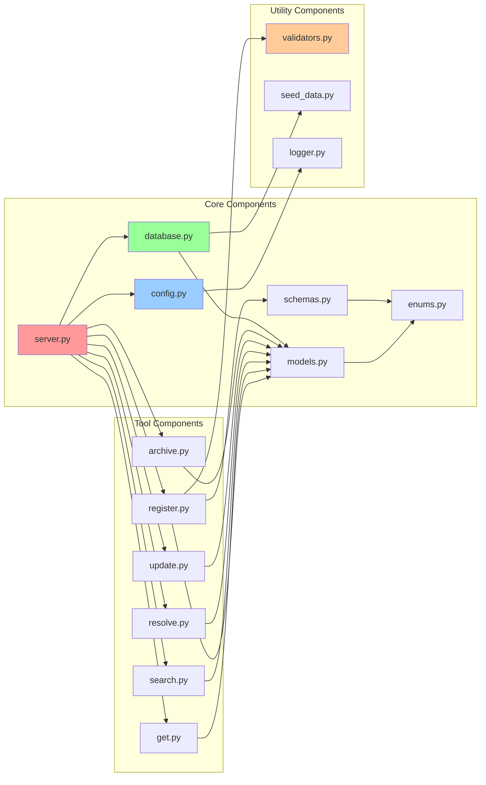
```mermaid
graph LR
    subgraph "Core Components"
        A[server.py]
        B[config.py]
        C[database.py]
        D[models.py]
        E[enums.py]
        F[schemas.py]
    end
    
    subgraph "Tool Components"
        G[register.py]
        H[get.py]
        I[search.py]
        J[resolve.py]
        K[update.py]
        L[archive.py]
    end
    
    subgraph "Utility Components"
        M[validators.py]
        N[seed_data.py]
        O[logger.py]
    end
    
    A --> B
    A --> C
    A --> G
    A --> H
    A --> I
    A --> J
    A --> K
    A --> L
    
    G --> D
    G --> F
    G --> M
    H --> D
    I --> D
    J --> D
    K --> D
    L --> D
    
    D --> E
    F --> E
    
    C --> D
    C --> N
    
    B --> O
    
    style A fill:#ff9999
    style B fill:#99ccff
    style C fill:#99ff99
    style M fill:#ffcc99
```

### 2.2 Component Responsibilities

| Component | Responsibility | Dependencies |
|-----------|---------------|--------------|
| `server.py` | Entry point, FastMCP setup, signal handling | All modules |
| `config.py` | Load and validate configuration | dotenv |
| `database.py` | Database connection, session management | SQLAlchemy, config |
| `models.py` | SQLAlchemy ORM models | SQLAlchemy, enums |
| `enums.py` | Enumeration definitions | Python enum |
| `schemas.py` | Pydantic validation schemas | Pydantic, enums |
| `tools/*.py` | MCP tool implementations | models, schemas, validators |
| `validators.py` | Input validation logic | re, schemas |
| `seed_data.py` | Database seeding | Faker, models, database |
| `logger.py` | Logging configuration | logging, config |

---

## 3. Data Architecture

### 3.1 Entity Relationship Diagram

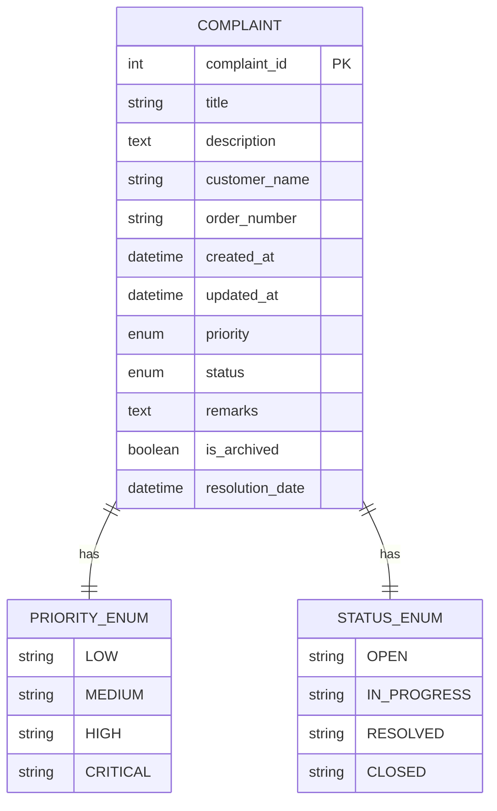
```mermaid
erDiagram
    COMPLAINT {
        int complaint_id PK
        string title
        text description
        string customer_name
        string order_number
        datetime created_at
        datetime updated_at
        enum priority
        enum status
        text remarks
        boolean is_archived
        datetime resolution_date
    }
    
    PRIORITY_ENUM {
        string LOW
        string MEDIUM
        string HIGH
        string CRITICAL
    }
    
    STATUS_ENUM {
        string OPEN
        string IN_PROGRESS
        string RESOLVED
        string CLOSED
    }
    
    COMPLAINT ||--|| PRIORITY_ENUM : has
    COMPLAINT ||--|| STATUS_ENUM : has
```

### 3.2 Data Flow Diagram

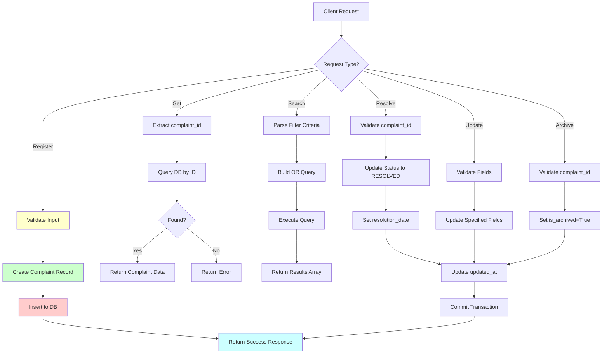
```mermaid
flowchart TD
    A[Client Request] --> B{Request Type?}
    
    B -->|Register| C[Validate Input]
    C --> D[Create Complaint Record]
    D --> E[Insert to DB]
    E --> F[Return Success Response]
    
    B -->|Get| G[Extract complaint_id]
    G --> H[Query DB by ID]
    H --> I{Found?}
    I -->|Yes| J[Return Complaint Data]
    I -->|No| K[Return Error]
    
    B -->|Search| L[Parse Filter Criteria]
    L --> M[Build OR Query]
    M --> N[Execute Query]
    N --> O[Return Results Array]
    
    B -->|Resolve| P[Validate complaint_id]
    P --> Q[Update Status to RESOLVED]
    Q --> R[Set resolution_date]
    R --> S[Update updated_at]
    S --> T[Commit Transaction]
    T --> F
    
    B -->|Update| U[Validate Fields]
    U --> V[Update Specified Fields]
    V --> S
    
    B -->|Archive| W[Validate complaint_id]
    W --> X[Set is_archived=True]
    X --> S
    
    style C fill:#ffffcc
    style D fill:#ccffcc
    style E fill:#ffcccc
    style F fill:#ccffff
```

### 3.3 State Transition Diagram

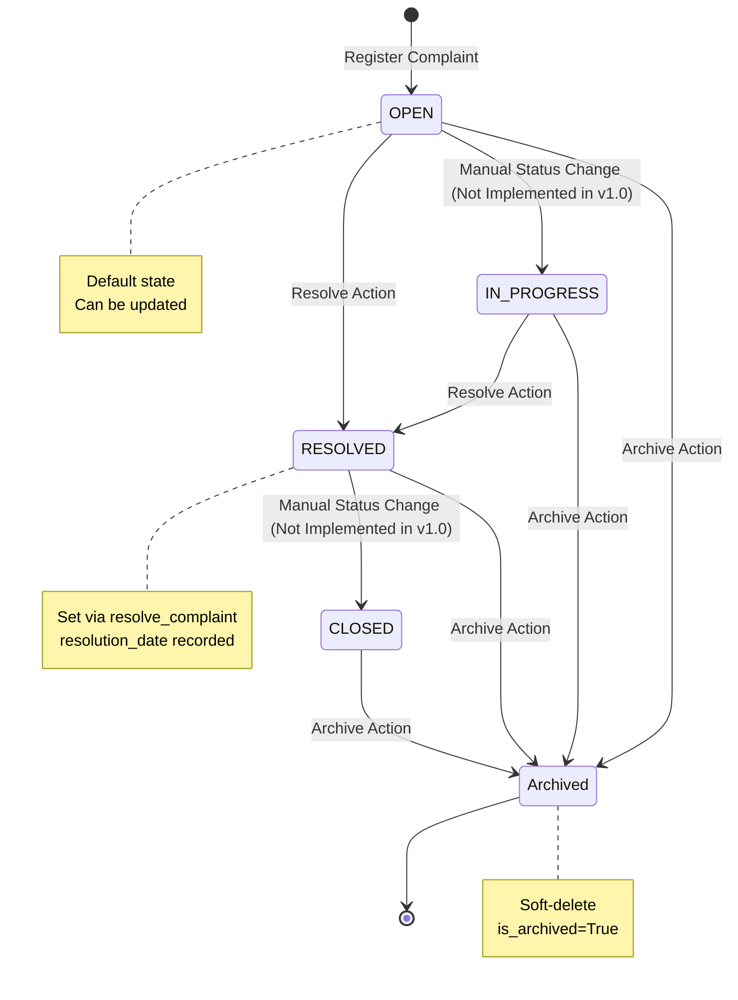
```mermaid
stateDiagram-v2
    [*] --> OPEN: Register Complaint
    
    OPEN --> IN_PROGRESS: Manual Status Change (Not Implemented in v1.0)
    IN_PROGRESS --> RESOLVED: Resolve Action
    OPEN --> RESOLVED: Resolve Action
    RESOLVED --> CLOSED: Manual Status Change (Not Implemented in v1.0)
    
    OPEN --> Archived: Archive Action
    IN_PROGRESS --> Archived: Archive Action
    RESOLVED --> Archived: Archive Action
    CLOSED --> Archived: Archive Action
    
    Archived --> [*]
    
    note right of OPEN
        Default state
        Can be updated
    end note
    
    note right of RESOLVED
        Set via resolve_complaint
        resolution_date recorded
    end note
    
    note right of Archived
        Soft-delete
        is_archived=True
    end note
```

---

## 4. Application Flow Architecture

### 4.1 Server Startup Flow

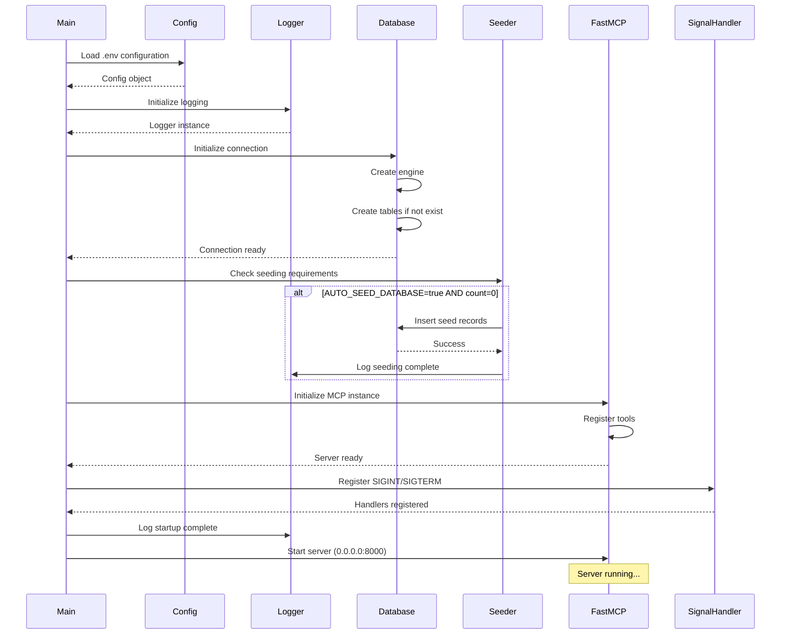
```mermaid
sequenceDiagram
    participant Main
    participant Config
    participant Logger
    participant Database
    participant Seeder
    participant FastMCP
    participant SignalHandler
    
    Main->>Config: Load .env configuration
    Config-->>Main: Config object
    
    Main->>Logger: Initialize logging
    Logger-->>Main: Logger instance
    
    Main->>Database: Initialize connection
    Database->>Database: Create engine
    Database->>Database: Create tables if not exist
    Database-->>Main: Connection ready
    
    Main->>Seeder: Check seeding requirements
    alt AUTO_SEED_DATABASE=true AND count=0
        Seeder->>Database: Insert seed records
        Database-->>Seeder: Success
        Seeder->>Logger: Log seeding complete
    end
    
    Main->>FastMCP: Initialize MCP instance
    FastMCP->>FastMCP: Register tools
    FastMCP-->>Main: Server ready
    
    Main->>SignalHandler: Register SIGINT/SIGTERM
    SignalHandler-->>Main: Handlers registered
    
    Main->>Logger: Log startup complete
    Main->>FastMCP: Start server (0.0.0.0:8000)
    
    Note over FastMCP: Server running...
```

### 4.2 Request Processing Flow

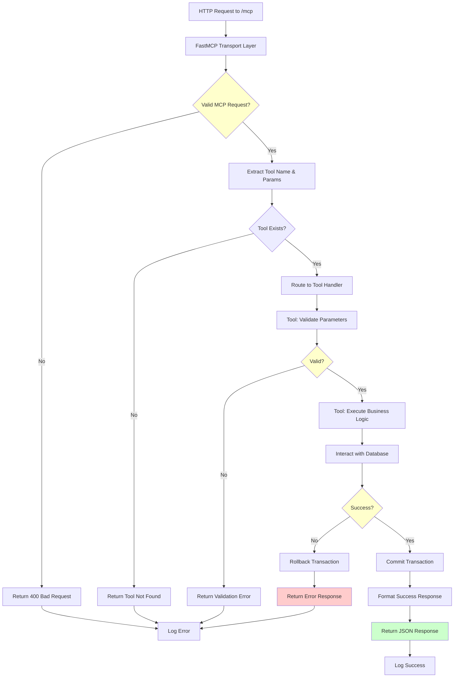
```mermaid
flowchart TD
    A[HTTP Request to /mcp] --> B[FastMCP Transport Layer]
    B --> C{Valid MCP Request?}
    
    C -->|No| D[Return 400 Bad Request]
    C -->|Yes| E[Extract Tool Name & Params]
    
    E --> F{Tool Exists?}
    F -->|No| G[Return Tool Not Found]
    F -->|Yes| H[Route to Tool Handler]
    
    H --> I[Tool: Validate Parameters]
    I --> J{Valid?}
    
    J -->|No| K[Return Validation Error]
    J -->|Yes| L[Tool: Execute Business Logic]
    
    L --> M[Interact with Database]
    M --> N{Success?}
    
    N -->|No| O[Rollback Transaction]
    O --> P[Return Error Response]
    
    N -->|Yes| Q[Commit Transaction]
    Q --> R[Format Success Response]
    R --> S[Return JSON Response]
    
    D --> T[Log Error]
    G --> T
    K --> T
    P --> T
    S --> U[Log Success]
    
    style C fill:#ffffcc
    style J fill:#ffffcc
    style N fill:#ffffcc
    style S fill:#ccffcc
    style P fill:#ffcccc
```

---

## 5. MCP Tools Architecture

### 5.1 Tool Invocation Pattern

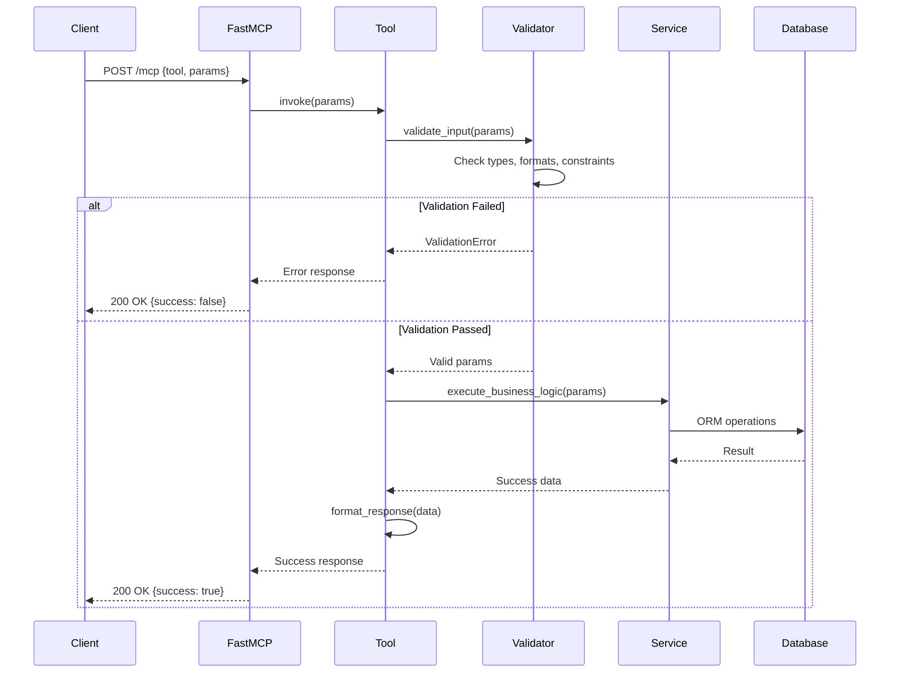
```mermaid
sequenceDiagram
    participant Client
    participant FastMCP
    participant Tool
    participant Validator
    participant Service
    participant Database
    
    Client->>FastMCP: POST /mcp {tool, params}
    FastMCP->>Tool: invoke(params)
    
    Tool->>Validator: validate_input(params)
    Validator->>Validator: Check types, formats, constraints
    
    alt Validation Failed
        Validator-->>Tool: ValidationError
        Tool-->>FastMCP: Error response
        FastMCP-->>Client: 200 OK {success: false}
    else Validation Passed
        Validator-->>Tool: Valid params
        Tool->>Service: execute_business_logic(params)
        Service->>Database: ORM operations
        Database-->>Service: Result
        Service-->>Tool: Success data
        Tool->>Tool: format_response(data)
        Tool-->>FastMCP: Success response
        FastMCP-->>Client: 200 OK {success: true}
    end
```

### 5.2 Tool Architecture Map

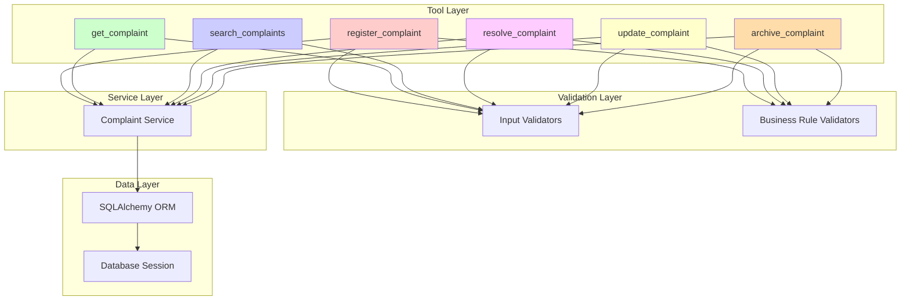
```mermaid
graph TD
    subgraph "Tool Layer"
        A[register_complaint]
        B[get_complaint]
        C[search_complaints]
        D[resolve_complaint]
        E[update_complaint]
        F[archive_complaint]
    end
    
    subgraph "Validation Layer"
        G[Input Validators]
        H[Business Rule Validators]
    end
    
    subgraph "Service Layer"
        I[Complaint Service]
    end
    
    subgraph "Data Layer"
        J[SQLAlchemy ORM]
        K[Database Session]
    end
    
    A --> G
    B --> G
    C --> G
    D --> G
    E --> G
    F --> G
    
    A --> H
    D --> H
    E --> H
    F --> H
    
    A --> I
    B --> I
    C --> I
    D --> I
    E --> I
    F --> I
    
    I --> J
    J --> K
    
    style A fill:#ffcccc
    style B fill:#ccffcc
    style C fill:#ccccff
    style D fill:#ffccff
    style E fill:#ffffcc
    style F fill:#ffddaa
```

---

## 6. Database Design & Schema

### 6.1 SQLAlchemy Model Architecture

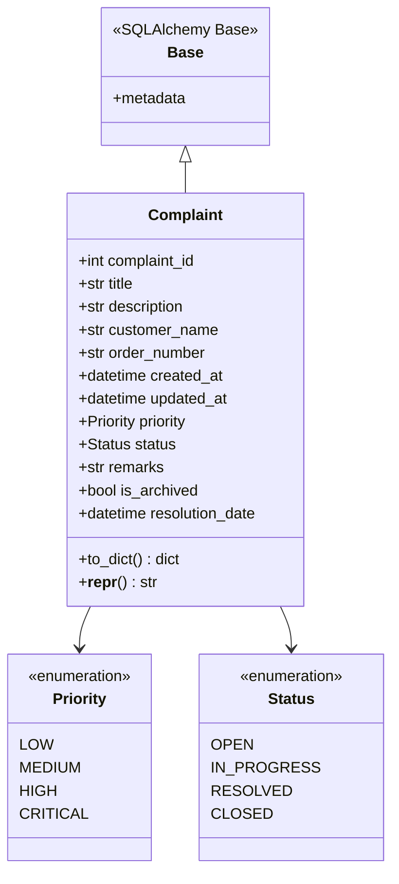
```mermaid
classDiagram
    class Complaint {
        +int complaint_id
        +str title
        +str description
        +str customer_name
        +str order_number
        +datetime created_at
        +datetime updated_at
        +Priority priority
        +Status status
        +str remarks
        +bool is_archived
        +datetime resolution_date
        +to_dict() dict
        +__repr__() str
    }
    
    class Priority {
        <<enumeration>>
        LOW
        MEDIUM
        HIGH
        CRITICAL
    }
    
    class Status {
        <<enumeration>>
        OPEN
        IN_PROGRESS
        RESOLVED
        CLOSED
    }
    
    class Base {
        <<SQLAlchemy Base>>
        +metadata
    }
    
    Base <|-- Complaint
    Complaint --> Priority
    Complaint --> Status
```

### 6.2 Database Schema SQL

```sql
CREATE TABLE complaints (
    complaint_id INTEGER PRIMARY KEY AUTOINCREMENT,
    title VARCHAR(200) NOT NULL,
    description TEXT NOT NULL,
    customer_name VARCHAR(100) NOT NULL,
    order_number VARCHAR(50) NOT NULL,
    created_at DATETIME NOT NULL DEFAULT CURRENT_TIMESTAMP,
    updated_at DATETIME NOT NULL DEFAULT CURRENT_TIMESTAMP,
    priority VARCHAR(20) NOT NULL DEFAULT 'MEDIUM',
    status VARCHAR(20) NOT NULL DEFAULT 'OPEN',
    remarks TEXT,
    is_archived BOOLEAN NOT NULL DEFAULT 0,
    resolution_date DATETIME,
    
    CHECK (priority IN ('LOW', 'MEDIUM', 'HIGH', 'CRITICAL')),
    CHECK (status IN ('OPEN', 'IN_PROGRESS', 'RESOLVED', 'CLOSED'))
);

CREATE INDEX idx_customer_name ON complaints(customer_name);
CREATE INDEX idx_order_number ON complaints(order_number);
CREATE INDEX idx_status ON complaints(status);
CREATE INDEX idx_is_archived ON complaints(is_archived);
CREATE INDEX idx_created_at ON complaints(created_at);
```

### 6.3 Database Session Management

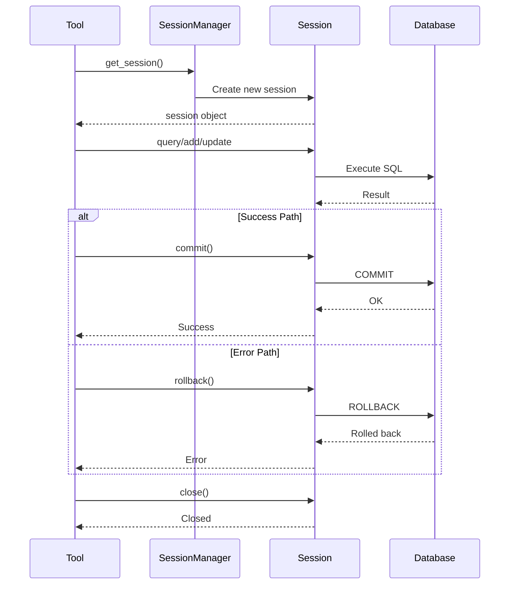
```mermaid
sequenceDiagram
    participant Tool
    participant SessionManager
    participant Session
    participant Database
    
    Tool->>SessionManager: get_session()
    SessionManager->>Session: Create new session
    Session-->>Tool: session object
    
    Tool->>Session: query/add/update
    Session->>Database: Execute SQL
    Database-->>Session: Result
    
    alt Success Path
        Tool->>Session: commit()
        Session->>Database: COMMIT
        Database-->>Session: OK
        Session-->>Tool: Success
    else Error Path
        Tool->>Session: rollback()
        Session->>Database: ROLLBACK
        Database-->>Session: Rolled back
        Session-->>Tool: Error
    end
    
    Tool->>Session: close()
    Session-->>Tool: Closed
```

---

## 7. Sequence Diagrams

### 7.1 Register Complaint Flow

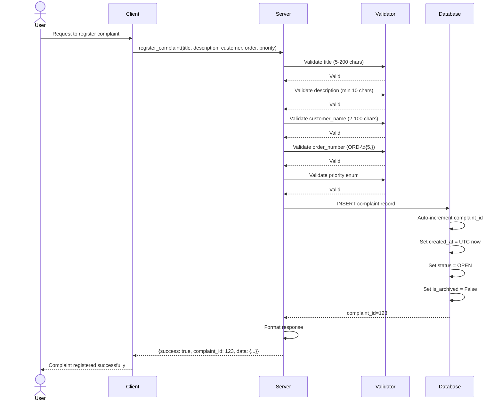
```mermaid
sequenceDiagram
    actor User
    participant Client
    participant Server
    participant Validator
    participant Database
    
    User->>Client: Request to register complaint
    Client->>Server: register_complaint(title, description, customer, order, priority)
    
    Server->>Validator: Validate title (5-200 chars)
    Validator-->>Server: Valid
    
    Server->>Validator: Validate description (min 10 chars)
    Validator-->>Server: Valid
    
    Server->>Validator: Validate customer_name (2-100 chars)
    Validator-->>Server: Valid
    
    Server->>Validator: Validate order_number (ORD-\d{5,})
    Validator-->>Server: Valid
    
    Server->>Validator: Validate priority enum
    Validator-->>Server: Valid
    
    Server->>Database: INSERT complaint record
    Database->>Database: Auto-increment complaint_id
    Database->>Database: Set created_at = UTC now
    Database->>Database: Set status = OPEN
    Database->>Database: Set is_archived = False
    Database-->>Server: complaint_id=123
    
    Server->>Server: Format response
    Server-->>Client: {success: true, complaint_id: 123, data: {...}}
    Client-->>User: Complaint registered successfully
```

### 7.2 Search Complaints Flow (OR Logic)

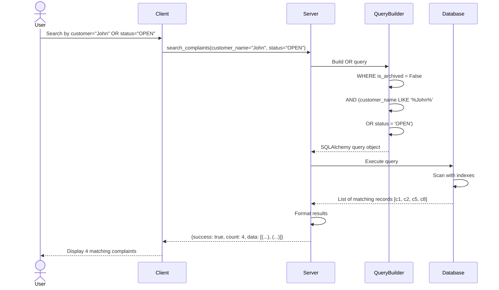
```mermaid
sequenceDiagram
    actor User
    participant Client
    participant Server
    participant QueryBuilder
    participant Database
    
    User->>Client: Search by customer="John" OR status="OPEN"
    Client->>Server: search_complaints(customer_name="John", status="OPEN")
    
    Server->>QueryBuilder: Build OR query
    QueryBuilder->>QueryBuilder: WHERE is_archived = False
    QueryBuilder->>QueryBuilder: AND (customer_name LIKE '%John%'
    QueryBuilder->>QueryBuilder: OR status = 'OPEN')
    QueryBuilder-->>Server: SQLAlchemy query object
    
    Server->>Database: Execute query
    Database->>Database: Scan with indexes
    Database-->>Server: List of matching records [c1, c2, c5, c8]
    
    Server->>Server: Format results
    Server-->>Client: {success: true, count: 4, data: [(...), (...)]}
    Client-->>User: Display 4 matching complaints
```

### 7.3 Resolve Complaint Flow

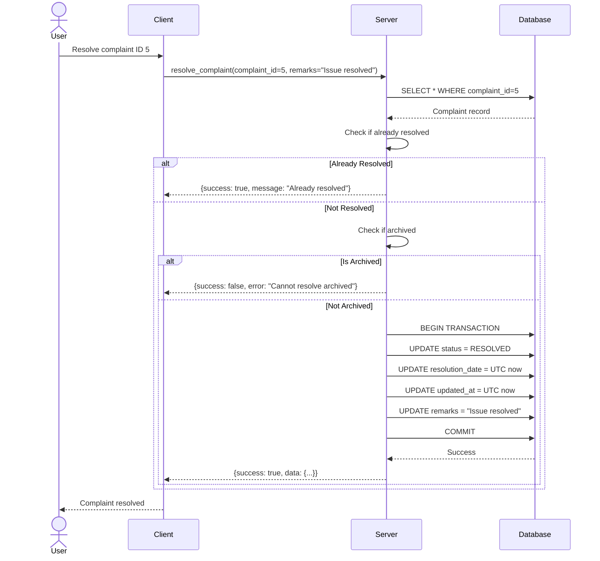
```mermaid
sequenceDiagram
    actor User
    participant Client
    participant Server
    participant Database
    
    User->>Client: Resolve complaint ID 5
    Client->>Server: resolve_complaint(complaint_id=5, remarks="Issue resolved")
    
    Server->>Database: SELECT * WHERE complaint_id=5
    Database-->>Server: Complaint record
    
    Server->>Server: Check if already resolved
    alt Already Resolved
        Server-->>Client: {success: true, message: "Already resolved"}
    else Not Resolved
        Server->>Server: Check if archived
        alt Is Archived
            Server-->>Client: {success: false, error: "Cannot resolve archived"}
        else Not Archived
            Server->>Database: BEGIN TRANSACTION
            Server->>Database: UPDATE status = RESOLVED
            Server->>Database: UPDATE resolution_date = UTC now
            Server->>Database: UPDATE updated_at = UTC now
            Server->>Database: UPDATE remarks = "Issue resolved"
            Server->>Database: COMMIT
            Database-->>Server: Success
            Server-->>Client: {success: true, data: {...}}
        end
    end
    
    Client-->>User: Complaint resolved
```

### 7.4 Database Seeding Flow

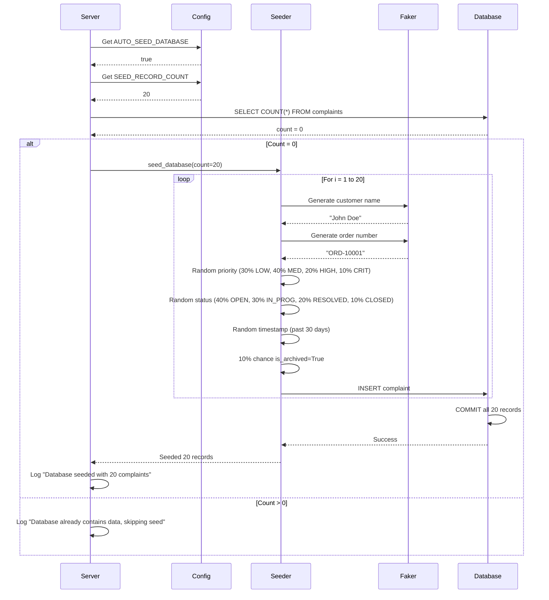
```mermaid
sequenceDiagram
    participant Server
    participant Config
    participant Seeder
    participant Faker
    participant Database
    
    Server->>Config: Get AUTO_SEED_DATABASE
    Config-->>Server: true
    
    Server->>Config: Get SEED_RECORD_COUNT
    Config-->>Server: 20
    
    Server->>Database: SELECT COUNT(*) FROM complaints
    Database-->>Server: count = 0
    
    alt Count = 0
        Server->>Seeder: seed_database(count=20)
        
        loop For i = 1 to 20
            Seeder->>Faker: Generate customer name
            Faker-->>Seeder: "John Doe"
            
            Seeder->>Faker: Generate order number
            Faker-->>Seeder: "ORD-10001"
            
            Seeder->>Seeder: Random priority (30% LOW, 40% MED, 20% HIGH, 10% CRIT)
            Seeder->>Seeder: Random status (40% OPEN, 30% IN_PROG, 20% RESOLVED, 10% CLOSED)
            Seeder->>Seeder: Random timestamp (past 30 days)
            Seeder->>Seeder: 10% chance is_archived=True
            
            Seeder->>Database: INSERT complaint
        end
        
        Database->>Database: COMMIT all 20 records
        Database-->>Seeder: Success
        Seeder-->>Server: Seeded 20 records
        Server->>Server: Log "Database seeded with 20 complaints"
    else Count > 0
        Server->>Server: Log "Database already contains data, skipping seed"
    end
```

---

## 8. Class Design

### 8.1 Core Classes

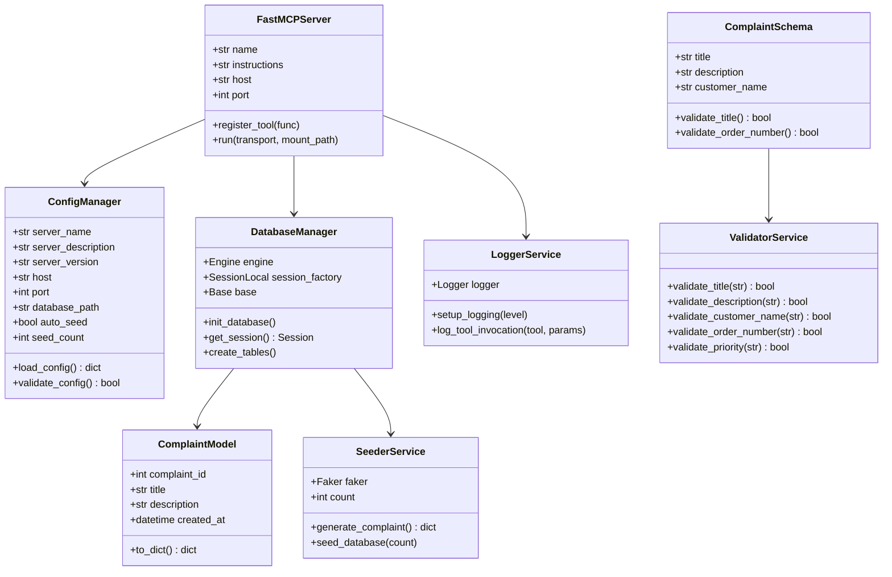
```mermaid
classDiagram
    class FastMCPServer {
        +str name
        +str instructions
        +str host
        +int port
        +register_tool(func)
        +run(transport, mount_path)
    }
    
    class ConfigManager {
        +str server_name
        +str server_description
        +str server_version
        +str host
        +int port
        +str database_path
        +bool auto_seed
        +int seed_count
        +load_config() dict
        +validate_config() bool
    }
    
    class DatabaseManager {
        +Engine engine
        +SessionLocal session_factory
        +Base base
        +init_database()
        +get_session() Session
        +create_tables()
    }
    
    class ComplaintModel {
        +int complaint_id
        +str title
        +str description
        +datetime created_at
        +to_dict() dict
    }
    
    class ComplaintSchema {
        +str title
        +str description
        +str customer_name
        +validate_title() bool
        +validate_order_number() bool
    }
    
    class ValidatorService {
        +validate_title(str) bool
        +validate_description(str) bool
        +validate_customer_name(str) bool
        +validate_order_number(str) bool
        +validate_priority(str) bool
    }
    
    class SeederService {
        +Faker faker
        +int count
        +generate_complaint() dict
        +seed_database(count)
    }
    
    class LoggerService {
        +Logger logger
        +setup_logging(level)
        +log_tool_invocation(tool, params)
    }
    
    FastMCPServer --> ConfigManager
    FastMCPServer --> DatabaseManager
    DatabaseManager --> ComplaintModel
    FastMCPServer --> LoggerService
    ComplaintSchema --> ValidatorService
    DatabaseManager --> SeederService
```

### 8.2 Tool Classes Architecture

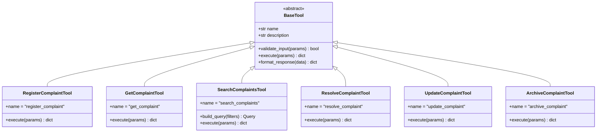
```mermaid
classDiagram
    class BaseTool {
        <<abstract>>
        +str name
        +str description
        +validate_input(params) bool
        +execute(params) dict
        +format_response(data) dict
    }
    
    class RegisterComplaintTool {
        +name = "register_complaint"
        +execute(params) dict
    }
    
    class GetComplaintTool {
        +name = "get_complaint"
        +execute(params) dict
    }
    
    class SearchComplaintsTool {
        +name = "search_complaints"
        +build_query(filters) Query
        +execute(params) dict
    }
    
    class ResolveComplaintTool {
        +name = "resolve_complaint"
        +execute(params) dict
    }
    
    class UpdateComplaintTool {
        +name = "update_complaint"
        +execute(params) dict
    }
    
    class ArchiveComplaintTool {
        +name = "archive_complaint"
        +execute(params) dict
    }
    
    BaseTool <|-- RegisterComplaintTool
    BaseTool <|-- GetComplaintTool
    BaseTool <|-- SearchComplaintsTool
    BaseTool <|-- ResolveComplaintTool
    BaseTool <|-- UpdateComplaintTool
    BaseTool <|-- ArchiveComplaintTool
```

---

## 9. Configuration Architecture

### 9.1 Configuration Hierarchy

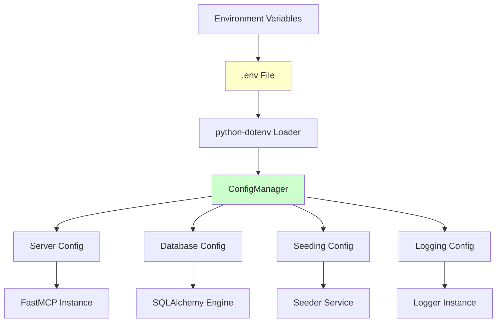
```mermaid
graph TD
    A[Environment Variables] --> B[.env File]
    B --> C[python-dotenv Loader]
    C --> D[ConfigManager]
    
    D --> E[Server Config]
    D --> F[Database Config]
    D --> G[Seeding Config]
    D --> H[Logging Config]
    
    E --> I[FastMCP Instance]
    F --> J[SQLAlchemy Engine]
    G --> K[Seeder Service]
    H --> L[Logger Instance]
    
    style B fill:#ffffcc
    style D fill:#ccffcc
```

### 9.2 Configuration Loading Flow

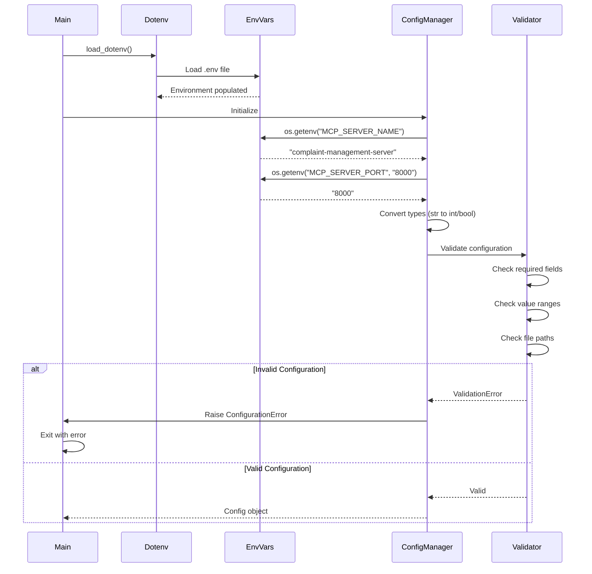
```mermaid
sequenceDiagram
    participant Main
    participant Dotenv
    participant EnvVars
    participant ConfigManager
    participant Validator
    
    Main->>Dotenv: load_dotenv()
    Dotenv->>EnvVars: Load .env file
    EnvVars-->>Dotenv: Environment populated
    
    Main->>ConfigManager: Initialize
    ConfigManager->>EnvVars: os.getenv("MCP_SERVER_NAME")
    EnvVars-->>ConfigManager: "complaint-management-server"
    
    ConfigManager->>EnvVars: os.getenv("MCP_SERVER_PORT", "8000")
    EnvVars-->>ConfigManager: "8000"
    
    ConfigManager->>ConfigManager: Convert types (str to int/bool)
    
    ConfigManager->>Validator: Validate configuration
    Validator->>Validator: Check required fields
    Validator->>Validator: Check value ranges
    Validator->>Validator: Check file paths
    
    alt Invalid Configuration
        Validator-->>ConfigManager: ValidationError
        ConfigManager->>Main: Raise ConfigurationError
        Main->>Main: Exit with error
    else Valid Configuration
        Validator-->>ConfigManager: Valid
        ConfigManager-->>Main: Config object
    end
```

---

## 10. Error Handling Architecture

### 10.1 Error Handling Hierarchy

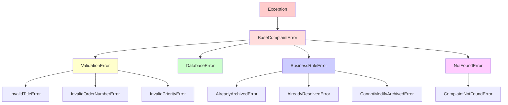
```mermaid
graph TD
    A[Exception] --> B[BaseComplaintError]
    
    B --> C[ValidationError]
    B --> D[DatabaseError]
    B --> E[BusinessRuleError]
    B --> F[NotFoundError]
    
    C --> G[InvalidTitleError]
    C --> H[InvalidOrderNumberError]
    C --> I[InvalidPriorityError]
    
    E --> J[AlreadyArchivedError]
    E --> K[AlreadyResolvedError]
    E --> L[CannotModifyArchivedError]
    
    F --> M[ComplaintNotFoundError]
    
    style A fill:#ffcccc
    style B fill:#ffdddd
    style C fill:#ffffcc
    style D fill:#ccffcc
    style E fill:#ccccff
    style F fill:#ffccff
```

### 10.2 Error Handling Flow

```mermaid
flowchart TD
    A[Tool Invocation] --> B{Try Block}
    
    B --> C[Validate Input]
    C --> D{Valid?}
    D -->|No| E[Raise ValidationError]
    D -->|Yes| F[Execute Business Logic]
    
    F --> G{Business Rules OK?}
    G -->|No| H[Raise BusinessRuleError]
    G -->|Yes| I[Database Operation]
    
    I --> J{DB Success?}
    J -->|No| K[Raise DatabaseError]
    J -->|Yes| L[Return Success]
    
    E --> M[Except ValidationError]
    H --> N[Except BusinessRuleError]
    K --> O[Except DatabaseError]
    
    M --> P[Format Error Response]
    N --> P
    O --> P
    
    P --> Q[Log Error]
    Q --> R[Return Error JSON]
    
    L --> S[Format Success Response]
    S --> T[Log Success]
    T --> U[Return Success JSON]
    
    style E fill:#ffcccc
    style H fill:#ffcccc
    style K fill:#ffcccc
    style L fill:#ccffcc
```

---

## 11. Logging Architecture

### 11.1 Logging Flow

```mermaid
graph LR
    A[Application Events] --> B{Log Level}
    
    B -->|DEBUG| C[Debug Logger]
    B -->|INFO| D[Info Logger]
    B -->|WARNING| E[Warning Logger]
    B -->|ERROR| F[Error Logger]
    
    C --> G[Formatter]
    D --> G
    E --> G
    F --> G
    
    G --> H[Console Handler]
    G --> I[File Handler]
    
    H --> J[stdout]
    I --> K[logs/server.log]
    
    style D fill:#ccffcc
    style E fill:#ffffcc
    style F fill:#ffcccc
```

### 11.2 Log Event Categories

```mermaid
mindmap
    root((Logging Events))
        Server Lifecycle
            Startup
            Shutdown
            Configuration Loaded
        Tool Invocations
            Tool Name
            Parameters (sanitized)
            Execution Time
            Result Status
        Database Operations
            Connection Events
            Query Execution
            Transaction Commit/Rollback
            Seeding Operations
        Errors
            Validation Errors
            Business Rule Violations
            Database Errors
            System Exceptions
        Performance
            Request Duration
            Query Execution Time
            Response Size
```

---

## 12. Deployment Architecture

### 12.1 Deployment Diagram

```mermaid
graph TB
    subgraph "Development Environment"
        A[Developer Machine]
        B[Python 3.12 Virtual Environment]
        C[SQLite Database File]
        D[FastMCP Server :8000]
    end
    
    subgraph "Testing Environment"
        E[Test Client]
        F[MCP Test Tools]
    end
    
    subgraph "Production Environment"
        G[Server Instance]
        H[Python 3.12]
        I[SQLite DB / PostgreSQL]
        J[FastMCP Server]
        K[Reverse Proxy / nginx]
        L[HTTPS Certificate]
    end
    
    A --> B
    B --> C
    B --> D
    
    E --> D
    F --> D
    
    G --> H
    H --> I
    H --> J
    K --> J
    L --> K
    
    M[External Clients] --> K
    
    style D fill:#ccffcc
    style J fill:#ccffcc
```

### 12.2 Process Architecture

```mermaid
graph TD
    A[Python Process] --> B[FastMCP Server Thread]
    B --> C[HTTP Transport Listener]
    
    C --> D[Request Handler Thread Pool]
    D --> E[Worker Thread 1]
    D --> F[Worker Thread 2]
    D --> G[Worker Thread N]
    
    E --> H[Database Connection Pool]
    F --> H
    G --> H
    
    H --> I[SQLite Database]
    
    A --> J[Signal Handler Thread]
    J --> K[Graceful Shutdown Manager]
    
    style B fill:#ccffcc
    style H fill:#ffffcc
    style I fill:#ffcccc
```

---

## 13. Security Considerations

### 13.1 Security Layers

```mermaid
graph TD
    A[Client Request] --> B[Transport Layer Security]
    B --> C{HTTPS?}
    C -->|No| D[Development Only]
    C -->|Yes| E[Production]
    
    E --> F[Input Validation Layer]
    F --> G[SQL Injection Prevention]
    F --> H[XSS Prevention]
    F --> I[Input Sanitization]
    
    G --> J[SQLAlchemy ORM]
    J --> K[Parameterized Queries]
    
    H --> L[Output Encoding]
    
    I --> M[Length Checks]
    I --> N[Format Validation]
    I --> O[Type Checking]
    
    K --> P[Database]
    L --> Q[Response]
    M --> R[Business Logic]
    N --> R
    O --> R
    
    style C fill:#ffffcc
    style F fill:#ffcccc
    style J fill:#ccffcc
```

### 13.2 Security Best Practices

| Layer | Security Measure | Implementation |
|-------|------------------|----------------|
| **Transport** | HTTPS in production | nginx reverse proxy with SSL |
| **Input Validation** | Schema validation | Pydantic models |
| **SQL Injection** | ORM usage | SQLAlchemy parameterized queries |
| **Authentication** | (Future) API keys | Not in v1.0 |
| **Authorization** | (Future) Role-based | Not in v1.0 |
| **Rate Limiting** | (Future) Request throttling | Not in v1.0 |
| **Logging** | Sanitize sensitive data | Remove passwords, tokens |
| **Database** | Read-only operations | Separate endpoints for read/write |

---

## 14. Performance Optimization

### 14.1 Database Optimization Strategy

```mermaid
graph LR
    A[Query Optimization] --> B[Add Indexes]
    B --> C[customer_name Index]
    B --> D[order_number Index]
    B --> E[status Index]
    B --> F[is_archived Index]
    
    A --> G[Query Planning]
    G --> H[Use EXPLAIN]
    G --> I[Analyze Query Plans]
    
    A --> J[Connection Pooling]
    J --> K[Reuse Connections]
    J --> L[Pool Size Configuration]
    
    A --> M[Lazy Loading]
    M --> N[Load Only Required Fields]
    
    style B fill:#ccffcc
    style J fill:#ccffcc
```

### 14.2 Performance Metrics

```mermaid
graph TD
    A[Performance Monitoring] --> B[Request Metrics]
    A --> C[Database Metrics]
    A --> D[System Metrics]
    
    B --> E[Average Response Time]
    B --> F[Request Throughput]
    B --> G[Error Rate]
    
    C --> H[Query Execution Time]
    C --> I[Connection Pool Usage]
    C --> J[Lock Wait Time]
    
    D --> K[CPU Usage]
    D --> L[Memory Usage]
    D --> M[Disk I/O]
    
    E --> N[Target: < 100ms]
    H --> O[Target: < 50ms]
    K --> P[Target: < 50%]
    
    style N fill:#ccffcc
    style O fill:#ccffcc
    style P fill:#ccffcc
```

---

## 15. Implementation Patterns

### 15.1 Repository Pattern

```mermaid
classDiagram
    class IComplaintRepository {
        <<interface>>
        +create(complaint) Complaint
        +get_by_id(id) Complaint
        +search(filters) List~Complaint~
        +update(id, data) Complaint
        +delete(id) bool
    }
    
    class ComplaintRepository {
        +Session session
        +create(complaint) Complaint
        +get_by_id(id) Complaint
        +search(filters) List~Complaint~
        +update(id, data) Complaint
        +delete(id) bool
    }
    
    class ComplaintService {
        +IComplaintRepository repository
        +register_complaint(data) dict
        +get_complaint(id) dict
        +search_complaints(filters) dict
        +resolve_complaint(id) dict
    }
    
    IComplaintRepository <|.. ComplaintRepository
    ComplaintService --> IComplaintRepository
```

### 15.2 Dependency Injection Pattern

```python
# Example implementation pattern
class ComplaintService:
    def __init__(self, repository: IComplaintRepository, validator: IValidator):
        self.repository = repository
        self.validator = validator
    
    def register_complaint(self, data: dict) -> dict:
        # Validate
        self.validator.validate(data)
        
        # Create
        complaint = self.repository.create(data)
        
        # Return
        return complaint.to_dict()

# Dependency injection in main
def initialize_services():
    repository = ComplaintRepository(session=get_session())
    validator = ComplaintValidator()
    service = ComplaintService(repository, validator)
    return service
```

### 15.3 Factory Pattern for Error Responses

```mermaid
classDiagram
    class ResponseFactory {
        +create_success(data) dict
        +create_error(error) dict
        +create_validation_error(errors) dict
        +create_not_found(id) dict
    }
    
    class SuccessResponse {
        +bool success
        +str message
        +dict data
        +to_dict() dict
    }
    
    class ErrorResponse {
        +bool success
        +dict error
        +str code
        +str message
        +to_dict() dict
    }
    
    ResponseFactory --> SuccessResponse
    ResponseFactory --> ErrorResponse
```

### 15.4 Transaction Management Pattern

```python
# Context manager pattern for transactions
from contextlib import contextmanager

@contextmanager
def transaction_scope(session):
    """Provide a transactional scope for database operations"""
    try:
        yield session
        session.commit()
    except Exception as e:
        session.rollback()
        raise
    finally:
        session.close()

# Usage
def register_complaint(data: dict):
    with transaction_scope(get_session()) as session:
        complaint = Complaint(**data)
        session.add(complaint)
        # Auto-commit on success, auto-rollback on error
    return complaint.to_dict()
```

---

## 16. Testing Architecture

### 16.1 Testing Pyramid

```mermaid
graph TD
    A[Testing Strategy] --> B[Unit Tests]
    A --> C[Integration Tests]
    A --> D[End-to-End Tests]
    
    B --> E[Validators]
    B --> F[Utilities]
    B --> G[Models]
    
    C --> H[Database Operations]
    C --> I[Tool Functions]
    
    D --> J[Full Request/Response Flow]
    D --> K[MCP Client Integration]
    
    style B fill:#ccffcc
    style C fill:#ffffcc
    style D fill:#ffcccc
```

### 16.2 Test Coverage Goals

| Component | Coverage Target | Test Types |
|-----------|----------------|------------|
| Models | 90%+ | Unit tests |
| Validators | 100% | Unit tests |
| Tools | 85%+ | Integration tests |
| Database | 80%+ | Integration tests |
| API Endpoints | 90%+ | E2E tests |
| Error Handling | 100% | Unit + Integration |

---

## 17. Monitoring & Observability

### 17.1 Observability Stack

```mermaid
graph TD
    A[Application] --> B[Logging]
    A --> C[Metrics]
    A --> D[Tracing]
    
    B --> E[Log Files]
    B --> F[Console Output]
    
    C --> G[Response Times]
    C --> H[Error Rates]
    C --> I[Request Counts]
    
    D --> J[Request Flow]
    D --> K[Database Queries]
    
    E --> L[Log Aggregation]
    G --> M[Metrics Dashboard]
    J --> N[Trace Visualization]
    
    style B fill:#ccffcc
    style C fill:#ffffcc
    style D fill:#ccccff
```

---

## Document Metadata

**Created:** February 18, 2026  
**Last Updated:** February 18, 2026  
**Version:** 1.0.0  
**Authors:** GitHub Copilot  
**Reviewers:** Ramkumar, Chandini, Priya, Ashok  
**Status:** Draft → **For Review**

---

**End of Technical Architecture Document**

