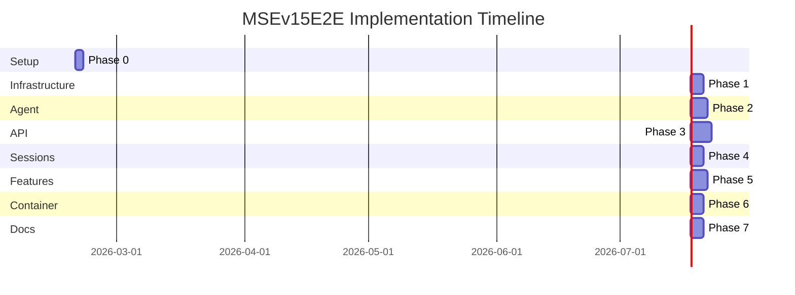
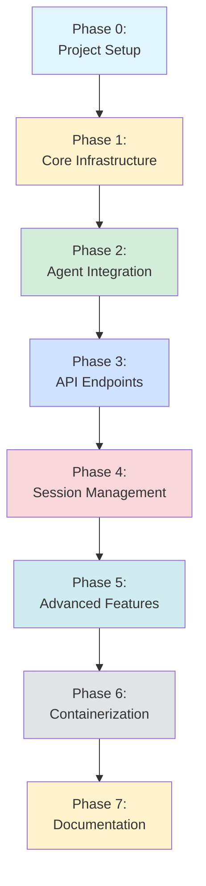
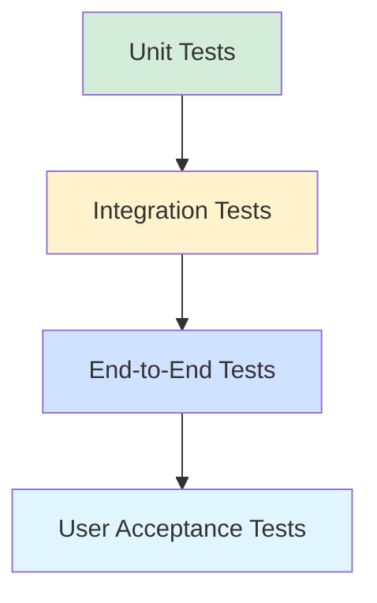

# MSEv15E2E Phased Implementation Plan

**Product Name:** MSEv15E2E (Microsoft Europe v15 End-to-End)  
**Version:** 0.1.0  
**Date:** February 19, 2026  
**Project Manager:** Hemanth Shah  
**Development Team:** Ramkumar, Rahul  

---

## Table of Contents

1. [Implementation Overview](#implementation-overview)
2. [Phase 0: Project Setup](#phase-0-project-setup)
3. [Phase 1: Core Infrastructure](#phase-1-core-infrastructure)
4. [Phase 2: Agent Integration](#phase-2-agent-integration)
5. [Phase 3: API Endpoints](#phase-3-api-endpoints)
6. [Phase 4: Session Management](#phase-4-session-management)
7. [Phase 5: Advanced Features](#phase-5-advanced-features)
8. [Phase 6: Containerization](#phase-6-containerization)
9. [Phase 7: Documentation & Polish](#phase-7-documentation--polish)
10. [Testing Strategy](#testing-strategy)
11. [Deployment Checklist](#deployment-checklist)
12. [Risk Management](#risk-management)

---

## Implementation Overview

### Project Timeline

**Total Estimated Duration:** 4-5 weeks (160-200 hours)



### Phase Dependencies



### Success Criteria

**Phase Completion Criteria:**
- ✅ All code implemented and tested
- ✅ Unit tests passing (>80% coverage)
- ✅ Integration tests passing
- ✅ Code reviewed and approved
- ✅ Documentation updated
- ✅ Phase demo completed

---

## Phase 0: Project Setup

**Duration:** 2 days  
**Effort:** 12-16 hours  
**Owner:** Ramkumar, Rahul  

### Objectives

Set up project structure, version control, and development environment.

### Tasks

#### Task 0.1: Repository Structure (4 hours)

**Deliverables:**
- [ ] Create directory structure as per architecture
- [ ] Initialize Git repository
- [ ] Create initial `.gitignore`
- [ ] Create `.dockerignore`

**Directory Creation:**
```bash
mkdir -p v16-e2e/back-end/{app,data,logs,tests}
mkdir -p app/{api,agent,tools,session,config,utils,startup}
mkdir -p app/api/{routes,middleware,schemas}
mkdir -p app/tools/{order_management,email_sender,wrappers}
mkdir -p tests/{test_api,test_agent,test_tools,test_session}
```

**`.gitignore`:**
```gitignore
# Python
__pycache__/
*.py[cod]
*$py.class
*.so
.Python
env/
venv/
*.egg-info/

# Environment
.env
.env.docker

# Data & Logs
data/
logs/
*.db
*.log

# IDE
.vscode/
.idea/
*.swp

# OS
.DS_Store
Thumbs.db
```

#### Task 0.2: Dependency Management (2 hours)

**Deliverables:**
- [ ] Create `requirements.txt`
- [ ] Set up virtual environment
- [ ] Install dependencies
- [ ] Verify installations

**`requirements.txt`:**
```
# Web Framework
fastapi==0.109.0
uvicorn[standard]==0.27.0
python-dotenv==1.0.0
pydantic==2.5.0
pydantic-settings==2.1.0

# Azure AI
azure-identity==1.15.0
azure-ai-inference==1.0.0b1
openai==1.10.0

# Agent Framework (adjust based on actual package)
agent-framework==1.0.0

# Database
sqlalchemy==2.0.25
alembic==1.13.1

# Email
secure-smtplib==0.1.1

# Utilities
python-multipart==0.0.6
aiofiles==23.2.1
slowapi==0.1.9

# Logging
python-json-logger==2.0.7

# Testing
pytest==7.4.4
pytest-asyncio==0.23.3
pytest-cov==4.1.0
httpx==0.26.0
```

#### Task 0.3: Configuration Setup (2 hours)

**Deliverables:**
- [ ] Create `.env.example`
- [ ] Create `.env` (from example)
- [ ] Create `.env.docker`
- [ ] Document configuration variables

#### Task 0.4: Development Tools (2 hours)

**Deliverables:**
- [ ] Set up code formatter (Black)
- [ ] Set up linter (Flake8, Pylint)
- [ ] Set up type checker (MyPy)
- [ ] Create pre-commit hooks (optional)

#### Task 0.5: Documentation Structure (2 hours)

**Deliverables:**
- [ ] Create README.md skeleton
- [ ] Create CONTRIBUTING.md
- [ ] Create CHANGELOG.md
- [ ] Add MIT LICENSE

### Testing Criteria

- [x] Virtual environment activates successfully
- [x] All dependencies install without errors
- [x] Configuration file loads properly
- [x] Directory structure matches architecture

### Risks & Mitigations

| Risk | Impact | Mitigation |
|------|--------|------------|
| Dependency conflicts | Medium | Pin exact versions |
| Agent framework unavailable | High | Verify package availability first |

---

## Phase 1: Core Infrastructure

**Duration:** 3 days  
**Effort:** 20-24 hours  
**Owner:** Ramkumar  
**Prerequisites:** Phase 0 complete  

### Objectives

Build foundational modules: configuration, logging, and utilities.

### Tasks

#### Task 1.1: Configuration Module (6 hours)

**Files:**
- `app/config/__init__.py`
- `app/config/settings.py`
- `app/config/validation.py`

**Deliverables:**
- [ ] Settings class with Pydantic
- [ ] Environment variable loading
- [ ] Type validation
- [ ] Sensitive data masking
- [ ] Configuration singleton pattern

**Code Structure:**
```python
# app/config/settings.py
from pydantic_settings import BaseSettings

class Settings(BaseSettings):
    # Server configuration
    SERVER_HOST: str = "0.0.0.0"
    SERVER_PORT: int = 9080
    LOG_LEVEL: str = "INFO"
    
    # ... (all config fields)
    
    class Config:
        env_file = ".env"
        case_sensitive = True
    
    def mask_sensitive(self) -> dict:
        """Return config with sensitive data masked"""
        config = self.model_dump()
        # Mask passwords, API keys
        return config

def get_settings() -> Settings:
    """Singleton settings instance"""
    ...
```

**Tests:**
- [ ] Test config loading from .env
- [ ] Test default values
- [ ] Test validation errors
- [ ] Test sensitive data masking

#### Task 1.2: Logging System (6 hours)

**Files:**
- `app/utils/__init__.py`
- `app/utils/logger.py`

**Deliverables:**
- [ ] Logger setup function
- [ ] Console handler with color
- [ ] File handler with rotation
- [ ] Structured log format
- [ ] Context injection (request_id, tenant_id)

**Code Structure:**
```python
# app/utils/logger.py
import logging
from logging.handlers import RotatingFileHandler

def setup_logger(
    name: str,
    level: str = "INFO",
    log_file: str = None,
    max_bytes: int = 100 * 1024 * 1024,
    backup_count: int = 5
) -> logging.Logger:
    """Setup logger with console and file handlers"""
    logger = logging.getLogger(name)
    logger.setLevel(level)
    
    # Console handler
    console_handler = logging.StreamHandler()
    console_handler.setFormatter(ColoredFormatter())
    logger.addHandler(console_handler)
    
    # File handler with rotation
    if log_file:
        file_handler = RotatingFileHandler(
            log_file, maxBytes=max_bytes, backupCount=backup_count
        )
        file_handler.setFormatter(JSONFormatter())
        logger.addHandler(file_handler)
    
    return logger
```

**Tests:**
- [ ] Test logger creation
- [ ] Test log level filtering
- [ ] Test file rotation
- [ ] Test structured format

#### Task 1.3: Utilities Module (4 hours)

**Files:**
- `app/utils/exceptions.py`
- `app/utils/helpers.py`

**Deliverables:**
- [ ] Custom exception hierarchy
- [ ] Helper functions (ID generation, date formatting)
- [ ] Validation utilities

**Exception Hierarchy:**
```python
class APIException(Exception):
    """Base API exception"""
    status_code = 500
    error_code = "INTERNAL_ERROR"

class ValidationError(APIException):
    status_code = 400
    error_code = "VALIDATION_ERROR"

class RateLimitError(APIException):
    status_code = 429
    error_code = "RATE_LIMIT_EXCEEDED"

# ... more exceptions
```

**Tests:**
- [ ] Test exception creation
- [ ] Test exception attributes
- [ ] Test helper functions

#### Task 1.4: Startup Module (4 hours)

**Files:**
- `app/startup/__init__.py`
- `app/startup/banner.py`
- `app/startup/checks.py`
- `app/startup/shutdown.py`

**Deliverables:**
- [ ] Welcome banner display
- [ ] Initialization health checks
- [ ] Graceful shutdown handler

**Code Structure:**
```python
# app/startup/banner.py
def display_banner(config: Settings):
    """Display welcome message and configuration"""
    banner = """
    ╔══════════════════════════════════════════════════╗
    ║              MSEv15E2E Service                   ║
    ║                 Version 0.1.0                    ║
    ╚══════════════════════════════════════════════════╝
    """
    print(banner)
    print(f"  • Host: {config.SERVER_HOST}")
    # ... more config details
```

**Tests:**
- [ ] Test banner generation
- [ ] Test health checks
- [ ] Test shutdown handler

### Testing Criteria

- [x] All unit tests passing
- [x] Configuration loads correctly
- [x] Logs written to file and console
- [x] Startup banner displays
- [x] No linting errors

### Deliverables Checklist

- [ ] Configuration module complete
- [ ] Logging system functional
- [ ] Utilities module implemented
- [ ] Startup/shutdown handlers ready
- [ ] Test coverage > 80%

---

## Phase 2: Agent Integration

**Duration:** 4 days  
**Effort:** 28-32 hours  
**Owner:** Rahul  
**Prerequisites:** Phase 1 complete  

### Objectives

Integrate agent framework, copy tool libraries, and create tool wrappers.

### Tasks

#### Task 2.1: Copy Tool Libraries (4 hours)

**Deliverables:**
- [ ] Copy order_management library → `app/tools/order_management/`
- [ ] Copy email_sender library → `app/tools/email_sender/`
- [ ] Update relative imports
- [ ] Test library functionality independently

**Commands:**
```bash
cp -r ../libraries/order_management app/tools/
cp -r ../libraries/email_sender app/tools/
```

**Tests:**
- [ ] Test order creation
- [ ] Test email sending
- [ ] Test database initialization
- [ ] Test SMTP connection

#### Task 2.2: Order Management Tool Wrappers (6 hours)

**Files:**
- `app/tools/wrappers/__init__.py`
- `app/tools/wrappers/order_tools.py`

**Deliverables:**
- [ ] Wrap all 6 order operations as `@tool` functions
- [ ] Add proper type hints
- [ ] Add comprehensive docstrings
- [ ] Handle exceptions gracefully

**Code Structure:**
```python
# app/tools/wrappers/order_tools.py
from typing import Annotated, Optional
from agent_framework import tool
from pydantic import Field
from ..order_management import operations as om

@tool(approval_mode="never_require")
async def tool_create_order(
    customer_name: Annotated[str, Field(description="Name of the customer")],
    billing_address: Annotated[str, Field(description="Billing address")],
    product_sku: Annotated[str, Field(description="Product SKU/code")],
    quantity: Annotated[int, Field(description="Quantity ordered")],
    order_amount: Annotated[float, Field(description="Total order amount")],
    remarks: Annotated[Optional[str], Field(description="Additional remarks")] = None,
    order_status: Annotated[str, Field(description="Order status")] = "PENDING"
) -> str:
    """Create a new customer order."""
    try:
        result = om.create_order(...)
        return f"Order created successfully: {result}"
    except Exception as e:
        return f"Error creating order: {str(e)}"

# ... 5 more tool wrappers
```

**Tests:**
- [ ] Test each tool wrapper
- [ ] Test error handling
- [ ] Test parameter validation

#### Task 2.3: Email Sender Tool Wrappers (6 hours)

**Files:**
- `app/tools/wrappers/email_tools.py`

**Deliverables:**
- [ ] Wrap all 5 email operations as `@tool` functions
- [ ] Handle comma-separated recipient lists
- [ ] Add proper error handling

**Tests:**
- [ ] Test each tool wrapper
- [ ] Test recipient parsing
- [ ] Test error scenarios

#### Task 2.4: MCP Tool Handler (6 hours)

**Files:**
- `app/tools/__init__.py`
- `app/tools/mcp_handler.py`

**Deliverables:**
- [ ] MCP tool initialization
- [ ] Connection health check
- [ ] Retry logic for failures
- [ ] Graceful degradation

**Code Structure:**
```python
# app/tools/mcp_handler.py
from agent_framework import MCPStreamableHTTPTool

class MCPToolHandler:
    def __init__(self, url: str, required: bool = False):
        self.url = url
        self.required = required
        self.tool = None
        
    async def initialize(self) -> bool:
        """Initialize MCP tool with health check"""
        try:
            self.tool = MCPStreamableHTTPTool(
                name="Complaints Management Server",
                url=self.url
            )
            # Health check
            return await self.health_check()
        except Exception as e:
            if self.required:
                raise
            logger.warning(f"MCP server unavailable: {e}")
            return False
    
    async def health_check(self) -> bool:
        """Check if MCP server is reachable"""
        ...
```

**Tests:**
- [ ] Test MCP initialization
- [ ] Test health check
- [ ] Test unavailable server handling

#### Task 2.5: Agent Manager (6 hours)

**Files:**
- `app/agent/__init__.py`
- `app/agent/manager.py`
- `app/agent/factory.py`
- `app/agent/instructions.py`

**Deliverables:**
- [ ] Agent initialization
- [ ] Tool registration
- [ ] Agent singleton pattern
- [ ] Health status

**Code Structure:**
```python
# app/agent/manager.py
from agent_framework.azure import AzureOpenAIResponsesClient

class AgentManager:
    def __init__(self, config: Settings):
        self.config = config
        self.agent = None
        self.client = None
        self.tools = []
        
    async def initialize(self):
        """Initialize agent with all tools"""
        # Initialize Azure OpenAI client
        credential = AzureCliCredential()
        self.client = AzureOpenAIResponsesClient(
            project_endpoint=self.config.AZURE_AI_PROJECT_ENDPOINT,
            deployment_name=self.config.AZURE_OPENAI_RESPONSES_DEPLOYMENT_NAME,
            credential=credential,
        )
        
        # Collect tools
        await self._load_tools()
        
        # Create agent
        self.agent = self.client.as_agent(
            name="CustomerServiceAgent",
            instructions=get_agent_instructions(),
            tools=self.tools
        )
    
    async def _load_tools(self):
        """Load MCP and local tools"""
        # MCP tool
        # Order tools
        # Email tools
        ...
```

**Tests:**
- [ ] Test agent initialization
- [ ] Test tool registration
- [ ] Test Azure OpenAI connection

### Testing Criteria

- [x] All tool wrappers functional
- [x] Agent initializes successfully
- [x] Tools registered with agent
- [x] MCP unavailability handled gracefully
- [x] Order database operational
- [x] Test coverage > 80%

### Deliverables Checklist

- [ ] Tool libraries copied and tested
- [ ] All 11 tool wrappers implemented
- [ ] MCP handler complete
- [ ] Agent manager functional
- [ ] Integration tests passing

---

## Phase 3: API Endpoints

**Duration:** 5 days  
**Effort:** 32-40 hours  
**Owner:** Ramkumar  
**Prerequisites:** Phase 2 complete  

### Objectives

Implement all REST API endpoints with FastAPI.

### Tasks

#### Task 3.1: API Schema Models (6 hours)

**Files:**
- `app/api/schemas/__init__.py`
- `app/api/schemas/chat.py`
- `app/api/schemas/session.py`
- `app/api/schemas/health.py`

**Deliverables:**
- [ ] Request/response models for all endpoints
- [ ] Validation rules
- [ ] Example data for OpenAPI

**Code Structure:**
```python
# app/api/schemas/chat.py
from pydantic import BaseModel, Field
from typing import Optional
from datetime import datetime

class ChatRequest(BaseModel):
    session_id: str = Field(..., min_length=1, max_length=255)
    message: str = Field(..., min_length=1, max_length=10000)
    tenant_id: Optional[str] = Field(default="default", max_length=255)
    
    model_config = {
        "json_schema_extra": {
            "examples": [{
                "session_id": "user-abc-123",
                "message": "I need help with my order",
                "tenant_id": "company-001"
            }]
        }
    }

class ChatResponse(BaseModel):
    session_id: str
    message: str
    timestamp: datetime
    message_count: int
    tenant_id: str
    request_id: Optional[str] = None
```

**Tests:**
- [ ] Test model validation
- [ ] Test serialization
- [ ] Test example data

#### Task 3.2: Health Endpoints (4 hours)

**Files:**
- `app/api/routes/__init__.py`
- `app/api/routes/health.py`

**Deliverables:**
- [ ] `GET /health` - Basic health
- [ ] `GET /health/readiness` - Readiness check
- [ ] `GET /health/liveness` - Liveness check

**Code Structure:**
```python
# app/api/routes/health.py
from fastapi import APIRouter, Depends
from ...agent.manager import AgentManager
from ...tools.mcp_handler import MCPToolHandler

router = APIRouter(prefix="/health", tags=["Health"])

@router.get("")
async def health_check():
    """Basic health check"""
    return {
        "status": "healthy",
        "timestamp": datetime.utcnow().isoformat()
    }

@router.get("/readiness")
async def readiness_check(
    agent_manager: AgentManager = Depends(get_agent_manager),
    mcp_handler: MCPToolHandler = Depends(get_mcp_handler)
):
    """Readiness check with dependencies"""
    checks = {
        "api": "healthy",
        "agent": "healthy" if agent_manager.agent else "unhealthy",
        "mcp_server": "healthy" if await mcp_handler.health_check() else "unavailable",
        "azure_openai": "healthy"  # Test connection
    }
    
    warnings = []
    if checks["mcp_server"] == "unavailable":
        warnings.append(f"MCP server not reachable at {mcp_handler.url}")
    
    return {
        "status": "ready",
        "checks": checks,
        "warnings": warnings
    }
```

**Tests:**
- [ ] Test /health endpoint
- [ ] Test /health/readiness
- [ ] Test /health/liveness
- [ ] Test with unavailable dependencies

#### Task 3.3: Chat Endpoints (Non-Streaming) (8 hours)

**Files:**
- `app/api/routes/chat.py`

**Deliverables:**
- [ ] `POST /api/v1/chat` - Non-streaming chat

**Code Structure:**
```python
# app/api/routes/chat.py
from fastapi import APIRouter, Depends, HTTPException, Request
from ...schemas.chat import ChatRequest, ChatResponse
from ...agent.manager import AgentManager
from ...session.manager import SessionManager

router = APIRouter(prefix="/api/v1", tags=["Chat"])

@router.post("/chat", response_model=ChatResponse)
async def chat(
    request: ChatRequest,
    http_request: Request,
    agent_manager: AgentManager = Depends(get_agent_manager),
    session_manager: SessionManager = Depends(get_session_manager)
):
    """Process chat message and return response"""
    request_id = str(uuid.uuid4())
    logger.info(
        "Chat request received",
        extra={
            "request_id": request_id,
            "session_id": request.session_id,
            "tenant_id": request.tenant_id,
            "ip": http_request.client.host
        }
    )
    
    try:
        # Get or create session
        session = await session_manager.get_or_create_session(
            session_id=request.session_id,
            tenant_id=request.tenant_id
        )
        
        # Run agent
        response_text = await agent_manager.agent.run(
            request.message,
            session=session.context
        )
        
        # Update session
        await session_manager.add_message(
            session_id=request.session_id,
            tenant_id=request.tenant_id,
            role="user",
            content=request.message
        )
        await session_manager.add_message(
            session_id=request.session_id,
            tenant_id=request.tenant_id,
            role="assistant",
            content=response_text
        )
        
        return ChatResponse(
            session_id=request.session_id,
            message=response_text,
            timestamp=datetime.utcnow(),
            message_count=len(session.messages) + 2,
            tenant_id=request.tenant_id,
            request_id=request_id
        )
        
    except Exception as e:
        logger.error(f"Chat error: {e}", extra={"request_id": request_id})
        raise HTTPException(status_code=500, detail=str(e))
```

**Tests:**
- [ ] Test successful chat
- [ ] Test new session creation
- [ ] Test existing session
- [ ] Test error handling

#### Task 3.4: Chat Endpoints (Streaming) (10 hours)

**Files:**
- `app/api/routes/chat.py` (extend)

**Deliverables:**
- [ ] `POST /api/v1/chat/stream` - Streaming chat

**Code Structure:**
```python
from fastapi.responses import StreamingResponse
from typing import AsyncGenerator

@router.post("/chat/stream")
async def chat_stream(
    request: ChatRequest,
    agent_manager: AgentManager = Depends(get_agent_manager),
    session_manager: SessionManager = Depends(get_session_manager)
):
    """Process chat with streaming response"""
    
    async def generate() -> AsyncGenerator[str, None]:
        session = await session_manager.get_or_create_session(
            session_id=request.session_id,
            tenant_id=request.tenant_id
        )
        
        full_response = ""
        
        # Stream tokens
        async for token in agent_manager.agent.run(
            request.message,
            session=session.context,
            stream=True
        ):
            full_response += token
            yield f"data: {json.dumps({'type': 'token', 'content': token, 'session_id': request.session_id})}\n\n"
        
        # Update session
        await session_manager.add_message(
            session_id=request.session_id,
            tenant_id=request.tenant_id,
            role="user",
            content=request.message
        )
        await session_manager.add_message(
            session_id=request.session_id,
            tenant_id=request.tenant_id,
            role="assistant",
            content=full_response
        )
        
        # Send done message
        yield f"data: {json.dumps({'type': 'done', 'session_id': request.session_id, 'message_count': len(session.messages)})}\n\n"
    
    return StreamingResponse(
        generate(),
        media_type="text/event-stream"
    )
```

**Tests:**
- [ ] Test streaming response
- [ ] Test token delivery
- [ ] Test completion message
- [ ] Test error during streaming

#### Task 3.5: FastAPI Application Setup (4 hours)

**Files:**
- `app/__init__.py`
- `app/main.py`
- `app/dependencies.py`

**Deliverables:**
- [ ] FastAPI app factory
- [ ] Router registration
- [ ] Dependency injection setup
- [ ] Global exception handlers

**Code Structure:**
```python
# app/main.py
from fastapi import FastAPI
from fastapi.middleware.cors import CORSMiddleware

def create_app(config: Settings) -> FastAPI:
    """Create and configure FastAPI application"""
    app = FastAPI(
        title="MSEv15E2E API",
        version="0.1.0",
        description="Customer Service Agent API"
    )
    
    # CORS
    if config.ENABLE_CORS:
        app.add_middleware(
            CORSMiddleware,
            allow_origins=[config.CORS_ORIGINS],
            allow_credentials=True,
            allow_methods=["*"],
            allow_headers=["*"],
        )
    
    # Include routers
    from .api.routes import health, chat, sessions
    app.include_router(health.router)
    app.include_router(chat.router)
    app.include_router(sessions.router)
    
    # Exception handlers
    @app.exception_handler(ValidationError)
    async def validation_error_handler(request, exc):
        return JSONResponse(
            status_code=400,
            content={"error": "Validation Error", "detail": str(exc)}
        )
    
    return app
```

**Tests:**
- [ ] Test app creation
- [ ] Test CORS configuration
- [ ] Test router registration
- [ ] Test exception handlers

### Testing Criteria

- [x] All endpoints respond correctly
- [x] OpenAPI docs accessible at /docs
- [x] Request validation working
- [x] Error responses formatted correctly
- [x] Streaming functional
- [x] Test coverage > 80%

### Deliverables Checklist

- [ ] All schema models complete
- [ ] Health endpoints functional
- [ ] Chat endpoint (non-streaming) working
- [ ] Chat endpoint (streaming) working
- [ ] FastAPI app configured
- [ ] API tests passing

---

## Phase 4: Session Management

**Duration:** 3 days  
**Effort:** 20-24 hours  
**Owner:** Rahul  
**Prerequisites:** Phase 3 complete  

### Objectives

Implement in-memory session management with multi-tenancy support.

### Tasks

#### Task 4.1: Session Store (6 hours)

**Files:**
- `app/session/__init__.py`
- `app/session/store.py`
- `app/session/models.py`

**Deliverables:**
- [ ] In-memory session storage
- [ ] Thread-safe operations
- [ ] Tenant isolation

**Code Structure:**
```python
# app/session/store.py
from typing import Dict, Optional
from threading import Lock
from .models import SessionData

class SessionStore:
    """Thread-safe in-memory session storage"""
    
    def __init__(self):
        self._sessions: Dict[str, SessionData] = {}
        self._lock = Lock()
    
    def get(self, session_key: str) -> Optional[SessionData]:
        """Get session by key (tenant_id:session_id)"""
        with self._lock:
            return self._sessions.get(session_key)
    
    def set(self, session_key: str, data: SessionData):
        """Store session data"""
        with self._lock:
            self._sessions[session_key] = data
    
    def delete(self, session_key: str) -> bool:
        """Delete session"""
        with self._lock:
            if session_key in self._sessions:
                del self._sessions[session_key]
                return True
            return False
    
    def list_by_tenant(self, tenant_id: str) -> list[SessionData]:
        """List all sessions for a tenant"""
        with self._lock:
            return [
                session for key, session in self._sessions.items()
                if session.tenant_id == tenant_id
            ]
```

**Tests:**
- [ ] Test get/set operations
- [ ] Test thread safety
- [ ] Test tenant filtering
- [ ] Test deletion

#### Task 4.2: Session Manager (8 hours)

**Files:**
- `app/session/manager.py`

**Deliverables:**
- [ ] Session CRUD operations
- [ ] Message management
- [ ] Session lifecycle

**Code Structure:**
```python
# app/session/manager.py
class SessionManager:
    def __init__(self, store: SessionStore):
        self.store = store
    
    def _make_key(self, tenant_id: str, session_id: str) -> str:
        """Create session key"""
        return f"{tenant_id}:{session_id}"
    
    async def get_or_create_session(
        self,
        session_id: str,
        tenant_id: str = "default"
    ) -> SessionData:
        """Get existing session or create new one"""
        key = self._make_key(tenant_id, session_id)
        session = self.store.get(key)
        
        if not session:
            session = SessionData(
                session_id=session_id,
                tenant_id=tenant_id,
                messages=[],
                created_at=datetime.utcnow(),
                last_activity=datetime.utcnow(),
                metadata={}
            )
            self.store.set(key, session)
        
        return session
    
    async def add_message(
        self,
        session_id: str,
        tenant_id: str,
        role: str,
        content: str
    ):
        """Add message to session"""
        session = await self.get_or_create_session(session_id, tenant_id)
        session.messages.append(
            SessionMessage(
                role=role,
                content=content,
                timestamp=datetime.utcnow()
            )
        )
        session.last_activity = datetime.utcnow()
        key = self._make_key(tenant_id, session_id)
        self.store.set(key, session)
    
    async def get_history(
        self,
        session_id: str,
        tenant_id: str = "default"
    ) -> Optional[SessionData]:
        """Get conversation history"""
        key = self._make_key(tenant_id, session_id)
        return self.store.get(key)
    
    async def delete_session(
        self,
        session_id: str,
        tenant_id: str = "default"
    ) -> bool:
        """Delete session"""
        key = self._make_key(tenant_id, session_id)
        return self.store.delete(key)
    
    async def list_sessions(
        self,
        tenant_id: str = "default",
        limit: int = 50,
        offset: int = 0
    ) -> list[SessionData]:
        """List sessions for tenant"""
        sessions = self.store.list_by_tenant(tenant_id)
        return sessions[offset:offset+limit]
```

**Tests:**
- [ ] Test session creation
- [ ] Test message addition
- [ ] Test history retrieval
- [ ] Test session deletion
- [ ] Test tenant isolation

#### Task 4.3: Session API Endpoints (6 hours)

**Files:**
- `app/api/routes/sessions.py`

**Deliverables:**
- [ ] `GET /api/v1/sessions/{session_id}/history`
- [ ] `DELETE /api/v1/sessions/{session_id}`
- [ ] `GET /api/v1/sessions`

**Code Structure:**
```python
# app/api/routes/sessions.py
from fastapi import APIRouter, Depends, HTTPException, Query

router = APIRouter(prefix="/api/v1/sessions", tags=["Sessions"])

@router.get("/{session_id}/history")
async def get_history(
    session_id: str,
    tenant_id: str = Query(default="default"),
    session_manager: SessionManager = Depends(get_session_manager)
):
    """Get conversation history for a session"""
    session = await session_manager.get_history(session_id, tenant_id)
    
    if not session:
        raise HTTPException(
            status_code=404,
            detail={"error": "Session not found", "session_id": session_id}
        )
    
    return {
        "session_id": session.session_id,
        "tenant_id": session.tenant_id,
        "message_count": len(session.messages),
        "created_at": session.created_at,
        "last_activity": session.last_activity,
        "messages": [
            {
                "role": msg.role,
                "content": msg.content,
                "timestamp": msg.timestamp
            }
            for msg in session.messages
        ]
    }

@router.delete("/{session_id}")
async def delete_session(
    session_id: str,
    tenant_id: str = Query(default="default"),
    session_manager: SessionManager = Depends(get_session_manager)
):
    """Delete a session"""
    deleted = await session_manager.delete_session(session_id, tenant_id)
    
    if not deleted:
        raise HTTPException(
            status_code=404,
            detail={"error": "Session not found", "session_id": session_id}
        )
    
    # Get message count before deletion
    return {
        "message": "Session deleted successfully",
        "session_id": session_id
    }

@router.get("")
async def list_sessions(
    tenant_id: str = Query(default="default"),
    limit: int = Query(default=50, le=100),
    offset: int = Query(default=0, ge=0),
    session_manager: SessionManager = Depends(get_session_manager)
):
    """List all sessions for a tenant"""
    sessions = await session_manager.list_sessions(tenant_id, limit, offset)
    
    return {
        "tenant_id": tenant_id,
        "total": len(sessions),
        "limit": limit,
        "offset": offset,
        "sessions": [
            {
                "session_id": s.session_id,
                "message_count": len(s.messages),
                "created_at": s.created_at,
                "last_activity": s.last_activity
            }
            for s in sessions
        ]
    }
```

**Tests:**
- [ ] Test get history
- [ ] Test delete session
- [ ] Test list sessions
- [ ] Test tenant isolation
- [ ] Test pagination

### Testing Criteria

- [x] Sessions persist across requests
- [x] Multi-tenant isolation verified
- [x] Thread-safe operations confirmed
- [x] All CRUD operations functional
- [x] Test coverage > 80%

### Deliverables Checklist

- [ ] Session store implemented
- [ ] Session manager complete
- [ ] Session endpoints functional
- [ ] Multi-tenancy working
- [ ] Tests passing

---

## Phase 5: Advanced Features

**Duration:** 4 days  
**Effort:** 28-32 hours  
**Owner:** Ramkumar  
**Prerequisites:** Phase 4 complete  

### Objectives

Implement rate limiting, middleware, and production features.

### Tasks

#### Task 5.1: Rate Limiting (8 hours)

**Files:**
- `app/api/middleware/__init__.py`
- `app/api/middleware/rate_limit.py`

**Deliverables:**
- [ ] Sliding window rate limiter
- [ ] Per-IP tracking
- [ ] Configurable limits
- [ ] Rate limit headers

**Code Structure:**
```python
# app/api/middleware/rate_limit.py
from slowapi import Limiter, _rate_limit_exceeded_handler
from slowapi.util import get_remote_address
from slowapi.errors import RateLimitExceeded

def create_rate_limiter(config: Settings) -> Optional[Limiter]:
    """Create rate limiter if enabled"""
    if not config.ENABLE_RATE_LIMITING:
        return None
    
    limiter = Limiter(
        key_func=get_remote_address,
        default_limits=[f"{config.RATE_LIMIT_PER_MINUTE}/minute"]
    )
    
    return limiter

# Usage in app
if rate_limiter:
    app.state.limiter = rate_limiter
    app.add_exception_handler(RateLimitExceeded, _rate_limit_exceeded_handler)
```

**Tests:**
- [ ] Test rate limit enforcement
- [ ] Test limit headers
- [ ] Test disabled mode
- [ ] Test bypass for health endpoints

#### Task 5.2: Request Logging Middleware (4 hours)

**Files:**
- `app/api/middleware/logging.py`

**Deliverables:**
- [ ] Request logging
- [ ] Response logging
- [ ] Performance timing
- [ ] Request ID injection

**Code Structure:**
```python
# app/api/middleware/logging.py
import time
import uuid
from starlette.middleware.base import BaseHTTPMiddleware

class RequestLoggingMiddleware(BaseHTTPMiddleware):
    async def dispatch(self, request, call_next):
        request_id = str(uuid.uuid4())
        request.state.request_id = request_id
        
        start_time = time.time()
        
        logger.info(
            f"Request started: {request.method} {request.url.path}",
            extra={
                "request_id": request_id,
                "method": request.method,
                "path": request.url.path,
                "ip": request.client.host
            }
        )
        
        response = await call_next(request)
        
        duration = time.time() - start_time
        
        logger.info(
            f"Request completed: {response.status_code}",
            extra={
                "request_id": request_id,
                "status_code": response.status_code,
                "duration_ms": duration * 1000
            }
        )
        
        response.headers["X-Request-ID"] = request_id
        return response
```

**Tests:**
- [ ] Test request logging
- [ ] Test response logging
- [ ] Test request ID injection
- [ ] Test timing

#### Task 5.3: Error Handling Middleware (4 hours)

**Files:**
- `app/api/middleware/errors.py`

**Deliverables:**
- [ ] Global exception handler
- [ ] Standardized error responses
- [ ] Error logging

**Code Structure:**
```python
# app/api/middleware/errors.py
from fastapi import Request
from fastapi.responses import JSONResponse

async def global_exception_handler(request: Request, exc: Exception):
    """Handle all unhandled exceptions"""
    request_id = getattr(request.state, "request_id", None)
    
    logger.error(
        f"Unhandled exception: {exc}",
        extra={"request_id": request_id},
        exc_info=True
    )
    
    return JSONResponse(
        status_code=500,
        content={
            "error": "Internal Server Error",
            "message": "An unexpected error occurred",
            "request_id": request_id,
            "timestamp": datetime.utcnow().isoformat()
        }
    )
```

**Tests:**
- [ ] Test exception handling
- [ ] Test error response format
- [ ] Test error logging

#### Task 5.4: CORS Middleware (2 hours)

**Files:**
- `app/api/middleware/cors.py`

**Deliverables:**
- [ ] CORS configuration
- [ ] Origin validation
- [ ] Preflight handling

**Already handled by FastAPI CORSMiddleware, just configuration**

#### Task 5.5: Graceful Shutdown (4 hours)

**Files:**
- `app/startup/shutdown.py`

**Deliverables:**
- [ ] Signal handlers (SIGINT, SIGTERM)
- [ ] Session cleanup
- [ ] Resource disposal
- [ ] Goodbye message

**Code Structure:**
```python
# app/startup/shutdown.py
import signal

def register_shutdown_handlers(app: FastAPI, session_manager: SessionManager):
    """Register graceful shutdown handlers"""
    
    def shutdown_handler(signum, frame):
        logger.info("Shutdown signal received...")
        
        # Close active sessions
        sessions = session_manager.store._sessions
        logger.info(f"  • Closing {len(sessions)} active sessions...")
        
        # Flush logs
        logger.info("  • Flushing logs...")
        logging.shutdown()
        
        # Cleanup
        logger.info("  • Cleanup complete.")
        print("Server stopped gracefully. Goodbye!")
        
        sys.exit(0)
    
    signal.signal(signal.SIGINT, shutdown_handler)
    signal.signal(signal.SIGTERM, shutdown_handler)
```

**Tests:**
- [ ] Test SIGINT handling
- [ ] Test cleanup execution

#### Task 5.6: Startup Banner (2 hours)

**Files:**
- `app/startup/banner.py` (enhance)

**Deliverables:**
- [ ] Detailed configuration display
- [ ] Dependency status
- [ ] Warnings display

**Tests:**
- [ ] Test banner generation
- [ ] Test configuration display

#### Task 5.7: API Documentation Enhancement (4 hours)

**Deliverables:**
- [ ] Comprehensive endpoint descriptions
- [ ] Request/response examples
- [ ] Error response documentation
- [ ] Tags and grouping

**Update all route decorators with:**
```python
@router.post(
    "/chat",
    response_model=ChatResponse,
    summary="Send a chat message",
    description="Process a user message and get AI agent response",
    responses={
        200: {"description": "Successful response"},
        400: {"description": "Invalid request"},
        429: {"description": "Rate limit exceeded"},
        500: {"description": "Internal server error"}
    }
)
```

**Tests:**
- [ ] Test OpenAPI schema generation
- [ ] Verify Swagger UI functionality

### Testing Criteria

- [x] Rate limiting functional
- [x] All middleware working
- [x] Graceful shutdown operational
- [x] Startup banner informative
- [x] API docs comprehensive
- [x] Test coverage > 80%

### Deliverables Checklist

- [ ] Rate limiting implemented
- [ ] All middleware functional
- [ ] Graceful shutdown working
- [ ] Enhanced startup banner
- [ ] API docs enhanced
- [ ] Tests passing

---

## Phase 6: Containerization

**Duration:** 3 days  
**Effort:** 20-24 hours  
**Owner:** Rahul  
**Prerequisites:** Phase 5 complete  

### Objectives

Create Docker configuration and docker-compose setup.

### Tasks

#### Task 6.1: Dockerfile (6 hours)

**Files:**
- `Dockerfile`

**Deliverables:**
- [ ] Multi-stage Alpine-based Dockerfile
- [ ] Optimized layer caching
- [ ] Security best practices
- [ ] No health check (as requested)

**Dockerfile:**
```dockerfile
# Stage 1: Builder
FROM python:3.11-alpine AS builder

# Install build dependencies
RUN apk add --no-cache \
    gcc \
    musl-dev \
    libffi-dev \
    openssl-dev \
    cargo

WORKDIR /build

# Copy requirements and install
COPY requirements.txt .
RUN pip install --user --no-cache-dir -r requirements.txt

# Stage 2: Runtime
FROM python:3.11-alpine

# Install runtime dependencies
RUN apk add --no-cache \
    libffi \
    openssl

# Create non-root user
RUN addgroup -g 1000 appuser && \
    adduser -D -u 1000 -G appuser appuser

WORKDIR /app

# Copy installed packages from builder
COPY --from=builder /root/.local /home/appuser/.local

# Copy application code
COPY --chown=appuser:appuser app/ ./app/
COPY --chown=appuser:appuser server.py .

# Create data and logs directories
RUN mkdir -p data logs && \
    chown -R appuser:appuser data logs

# Switch to non-root user
USER appuser

# Add local bin to PATH
ENV PATH=/home/appuser/.local/bin:$PATH

# Expose port
EXPOSE 9080

# Run application
CMD ["python", "server.py"]
```

**Tests:**
- [ ] Test image builds successfully
- [ ] Test image size (< 300MB)
- [ ] Test container runs
- [ ] Test non-root user

#### Task 6.2: Docker Compose (4 hours)

**Files:**
- `docker-compose.yml`

**Deliverables:**
- [ ] Service definition
- [ ] Environment file reference
- [ ] Volume mappings
- [ ] Network configuration

**docker-compose.yml:**
```yaml
services:
  api:
    image: msev15-e2e-service
    container_name: msev15-e2e-api
    build:
      context: .
      dockerfile: Dockerfile
    env_file:
      - .env.docker
    ports:
      - "${SERVER_PORT:-9080}:9080"
    volumes:
      - ./data:/app/data
      - ./logs:/app/logs
    restart: unless-stopped
    networks:
      - msev15-network
    deploy:
      resources:
        limits:
          cpus: '2'
          memory: 2G
        reservations:
          cpus: '1'
          memory: 1G

networks:
  msev15-network:
    name: msev15-network
    driver: bridge
```

**Tests:**
- [ ] Test compose up
- [ ] Test volume mounts
- [ ] Test port mapping
- [ ] Test environment loading

#### Task 6.3: Docker Ignore (2 hours)

**Files:**
- `.dockerignore`

**Deliverables:**
```dockerignore
# Python
__pycache__/
*.py[cod]
*$py.class
*.so
.Python
env/
venv/
*.egg-info/

# Environment
.env
.env.docker
.env.example

# Data & Logs
data/
logs/
*.db
*.log

# Development
.git/
.github/
.vscode/
.idea/
*.swp

# Tests
tests/
.pytest_cache/
.coverage
htmlcov/

# Documentation
docs/
*.md
!README.md

# CI/CD
.gitlab-ci.yml
.github/

# OS
.DS_Store
Thumbs.db
```

#### Task 6.4: Environment Files (4 hours)

**Files:**
- `.env.docker`
- `.env.example`

**Deliverables:**
- [ ] Docker-specific environment file
- [ ] Example configuration
- [ ] Documentation

**.env.docker:**
```ini
# Server Configuration
SERVER_HOST=0.0.0.0
SERVER_PORT=9080
LOG_LEVEL=INFO
ENABLE_CORS=true
CORS_ORIGINS=*

# Rate Limiting
ENABLE_RATE_LIMITING=false
RATE_LIMIT_PER_MINUTE=100

# Azure OpenAI Configuration
AZURE_AI_PROJECT_ENDPOINT=https://your-project.services.ai.azure.com/api/projects/your-project
AZURE_OPENAI_RESPONSES_DEPLOYMENT_NAME=gpt-4o
AZURE_OPENAI_ENDPOINT=https://your-resource.cognitiveservices.azure.com
AZURE_OPENAI_API_KEY=your-api-key

# MCP Server Configuration
MCP_SERVER_URL=http://host.docker.internal:8000/mcp
MCP_SERVER_REQUIRED=false

# Order Management Database
ORDER_DB_PATH=/app/data/orders.db

# Email Configuration
SMTP_SERVER=smtp.gmail.com
SMTP_PORT=587
SENDER_EMAIL=your-email@gmail.com
SENDER_PASSWORD=your-app-password
SENDER_NAME=Customer Service

# Logging Configuration
LOG_TO_FILE=true
LOG_FILE_PATH=/app/logs/app.log
LOG_MAX_SIZE_MB=100
LOG_BACKUP_COUNT=5
```

#### Task 6.5: Build and Test (4 hours)

**Deliverables:**
- [ ] Build script
- [ ] Test script
- [ ] Deployment documentation

**Build script (build.sh):**
```bash
#!/bin/bash

echo "Building MSEv15E2E Service..."

# Build Docker image
docker build -t msev15-e2e-service:latest .

echo "Build complete!"
echo "Image: msev15-e2e-service:latest"

# Show image size
docker images msev15-e2e-service:latest
```

**Tests:**
- [ ] Test build process
- [ ] Test container startup
- [ ] Test API accessibility
- [ ] Test volume persistence

### Testing Criteria

- [x] Docker image builds successfully
- [x] Container runs without errors
- [x] Volumes mounted correctly
- [x] API accessible from host
- [x] Logs written to volume
- [x] Image size optimized

### Deliverables Checklist

- [ ] Dockerfile complete
- [ ] docker-compose.yml ready
- [ ] .dockerignore configured
- [ ] Environment files prepared
- [ ] Build scripts created
- [ ] Container tested

---

## Phase 7: Documentation & Polish

**Duration:** 3 days  
**Effort:** 20-24 hours  
**Owner:** Ramkumar, Rahul  
**Prerequisites:** Phase 6 complete  

### Objectives

Complete all documentation and finalize project.

### Tasks

#### Task 7.1: README.md (6 hours)

**Deliverables:**
- [ ] Project overview
- [ ] Quick start guide
- [ ] Installation instructions
- [ ] API usage examples
- [ ] Configuration reference
- [ ] Development guide
- [ ] Troubleshooting

**Structure:**
```markdown
# MSEv15E2E - Customer Service Agent API

## Overview
(Product description)

## Quick Start
(Docker quick start)

## Installation
(Local and Docker)

## Configuration
(Environment variables)

## API Usage
(Example requests)

## Development
(Local setup)

## Testing
(Running tests)

## Deployment
(Production deployment)

## Troubleshooting
(Common issues)

## Contributing
(Link to CONTRIBUTING.md)

## License
(MIT)
```

#### Task 7.2: CONTRIBUTING.md (3 hours)

**Deliverables:**
- [ ] Team structure
- [ ] Development workflow
- [ ] Code standards
- [ ] Testing requirements
- [ ] Pull request process

**Content:**
```markdown
# Contributing to MSEv15E2E

## Team
- **Product Manager:** Hemanth Shah
- **Developers:** Ramkumar, Rahul

## Development Workflow
(Git workflow, branching strategy)

## Code Standards
(Formatting, linting, type hints)

## Testing Requirements
(Coverage, test structure)

## Pull Request Process
(Review checklist)
```

#### Task 7.3: CHANGELOG.md (2 hours)

**Deliverables:**
- [ ] Version 0.1.0 entry
- [ ] Feature list
- [ ] Known issues

**Content:**
```markdown
# Changelog

## [0.1.0] - 2026-02-19

### Added
- Initial release of MSEv15E2E Customer Service Agent API
- Chat endpoint with streaming support
- Session management with multi-tenancy
- Order management tools (6 operations)
- Email sender tools (5 operations)
- MCP server integration for complaints
- Rate limiting (configurable)
- Health check endpoints
- Graceful shutdown
- Docker support with Alpine base
- Comprehensive logging
- OpenAPI documentation

### Known Issues
- Sessions are in-memory only (lost on restart)
- MCP server must be running separately
```

#### Task 7.4: LICENSE (1 hour)

**Deliverables:**
- [ ] MIT License file

#### Task 7.5: API Examples (4 hours)

**Deliverables:**
- [ ] Postman collection
- [ ] cURL examples
- [ ] Python client example

**Create directory:**
```
examples/
├── postman_collection.json
├── curl_examples.sh
└── python_client.py
```

#### Task 7.6: Code Cleanup (4 hours)

**Deliverables:**
- [ ] Remove debug code
- [ ] Add missing docstrings
- [ ] Format all code (Black)
- [ ] Fix linting issues
- [ ] Update type hints

**Tasks:**
```bash
# Format code
black app/ tests/

# Check linting
flake8 app/ tests/

# Check types
mypy app/

# Update docstrings
# Manual review
```

### Testing Criteria

- [x] README clear and comprehensive
- [x] All documentation complete
- [x] Code formatted and linted
- [x] Examples working
- [x] No debug code remaining

### Deliverables Checklist

- [ ] README.md complete
- [ ] CONTRIBUTING.md written
- [ ] CHANGELOG.md updated
- [ ] LICENSE added
- [ ] API examples created
- [ ] Code cleaned and formatted

---

## Testing Strategy

### Test Levels



### Unit Testing

**Coverage Target:** > 80%

**Test Categories:**
- Configuration loading
- Utilities and helpers
- Session management
- Tool wrappers
- Schema validation

**Tools:**
- pytest
- pytest-asyncio
- pytest-cov

**Command:**
```bash
pytest tests/ --cov=app --cov-report=html
```

### Integration Testing

**Test Scenarios:**
- Agent initialization
- Tool execution
- API endpoint responses
- Middleware functionality

**Fixtures:**
```python
# tests/conftest.py
@pytest.fixture
async def test_client():
    app = create_app(test_settings)
    async with AsyncClient(app=app, base_url="http://test") as client:
        yield client

@pytest.fixture
def mock_agent_manager():
    # Mock agent for testing
    ...
```

### End-to-End Testing

**Test Flows:**
1. Complete chat conversation
2. Session lifecycle
3. Streaming response
4. Multi-tenant operations

**Example:**
```python
async def test_complete_chat_flow(test_client):
    # Send first message
    response1 = await test_client.post("/api/v1/chat", json={
        "session_id": "test-123",
        "message": "Hello"
    })
    assert response1.status_code == 200
    
    # Get history
    response2 = await test_client.get("/api/v1/sessions/test-123/history")
    assert len(response2.json()["messages"]) == 2
    
    # Delete session
    response3 = await test_client.delete("/api/v1/sessions/test-123")
    assert response3.status_code == 200
```

### Performance Testing

**Test Scenarios:**
- Response time under load
- Concurrent requests
- Memory usage
- Rate limiting accuracy

**Tools:**
- locust
- ab (Apache Bench)

### Manual Testing Checklist

- [ ] API responds to requests
- [ ] Streaming works in browser
- [ ] Swagger UI functional
- [ ] Docker container runs
- [ ] Logs written correctly
- [ ] Graceful shutdown works
- [ ] MCP unavailability handled
- [ ] Rate limiting enforces limits
- [ ] Multi-tenancy isolated
- [ ] Error responses formatted

---

## Deployment Checklist

### Pre-Deployment

- [ ] All tests passing
- [ ] Code reviewed
- [ ] Documentation complete
- [ ] Environment variables set
- [ ] Secrets secured
- [ ] Dependencies verified

### Development Deployment

```bash
# Local development
python server.py

# Or with uvicorn
uvicorn app.main:app --reload --port 9080
```

### Docker Deployment

```bash
# Build image
docker build -t msev15-e2e-service:0.1.0 .

# Run with compose
docker-compose up -d

# View logs
docker-compose logs -f api

# Stop
docker-compose down
```

### Production Deployment

- [ ] Use production .env
- [ ] Enable rate limiting
- [ ] Configure CORS properly
- [ ] Set up log aggregation
- [ ] Configure monitoring
- [ ] Set up backups
- [ ] Document rollback procedure

### Post-Deployment Verification

- [ ] Health endpoints responding
- [ ] API accessible
- [ ] Logs being written
- [ ] Sessions working
- [ ] Tools functional
- [ ] Performance acceptable

---

## Risk Management

### Technical Risks

| Risk | Likelihood | Impact | Mitigation |
|------|------------|--------|------------|
| Agent framework issues | Medium | High | Early testing, fallback plans |
| MCP server unavailability | High | Medium | Graceful degradation implemented |
| Memory leaks in sessions | Low | High | Monitoring, periodic cleanup |
| Rate limiter performance | Low | Medium | Use proven library (slowapi) |
| Azure OpenAI quota | Medium | High | Implement retry logic, quotas |

### Schedule Risks

| Risk | Impact | Mitigation |
|------|--------|------------|
| Dependencies delayed | +1 week | Parallel development where possible |
| Testing finds major bugs | +3-5 days | Thorough unit testing throughout |
| Agent integration complex | +2-3 days | Allocate buffer time in Phase 2 |
| Documentation takes longer | +2 days | Start documentation early |

### Quality Risks

| Risk | Mitigation |
|------|------------|
| Incomplete testing | Enforce >80% coverage requirement |
| Poor documentation | Use templates, peer review |
| Code quality issues | Automated linting, code review |
| Performance problems | Load testing before deployment |

---

## Appendix

### Phase Effort Summary

| Phase | Duration | Effort (hours) | Developers |
|-------|----------|----------------|------------|
| Phase 0 | 2 days | 12-16 | Both |
| Phase 1 | 3 days | 20-24 | Ramkumar |
| Phase 2 | 4 days | 28-32 | Rahul |
| Phase 3 | 5 days | 32-40 | Ramkumar |
| Phase 4 | 3 days | 20-24 | Rahul |
| Phase 5 | 4 days | 28-32 | Ramkumar |
| Phase 6 | 3 days | 20-24 | Rahul |
| Phase 7 | 3 days | 20-24 | Both |
| **Total** | **27 days** | **180-216 hours** | **2 developers** |

### Communication Plan

**Daily Standups:** 15 minutes
- What was completed yesterday
- What's planned for today
- Any blockers

**Weekly Review:** With Hemanth Shah
- Progress update
- Demo of completed phases
- Adjust plans if needed

**Phase Demos:** End of each phase
- Demonstrate functionality
- Get feedback
- Sign-off to proceed

### Success Metrics

**Development Metrics:**
- Test coverage > 80%
- Zero critical bugs
- All phases completed on time

**Quality Metrics:**
- Code review approval
- Documentation completeness
- Performance targets met

**Deployment Metrics:**
- Successful deployment
- API uptime > 99%
- No critical issues in first week

---

**Document Version:** 1.0  
**Last Updated:** February 19, 2026  
**Next Review:** End of Phase 2  
**Approval:** Hemanth Shah (Product Manager)

