# MSEv15E2E Technical Architecture

**Product Name:** MSEv15E2E (Microsoft Europe v15 End-to-End)  
**Version:** 0.1.0  
**Date:** February 19, 2026  
**Author:** Technical Team (Ramkumar, Rahul)  
**Reviewer:** Hemanth Shah (Product Manager)

---

## Table of Contents

1. [Architecture Overview](#architecture-overview)
2. [System Components](#system-components)
3. [Component Interactions](#component-interactions)
4. [Request Flow Diagrams](#request-flow-diagrams)
5. [Data Models](#data-models)
6. [Module Structure](#module-structure)
7. [Configuration Management](#configuration-management)
8. [Logging Architecture](#logging-architecture)
9. [Error Handling Strategy](#error-handling-strategy)
10. [Scalability Considerations](#scalability-considerations)
11. [Security Architecture](#security-architecture)
12. [Deployment Architecture](#deployment-architecture)

---

## Architecture Overview

### High-Level Architecture

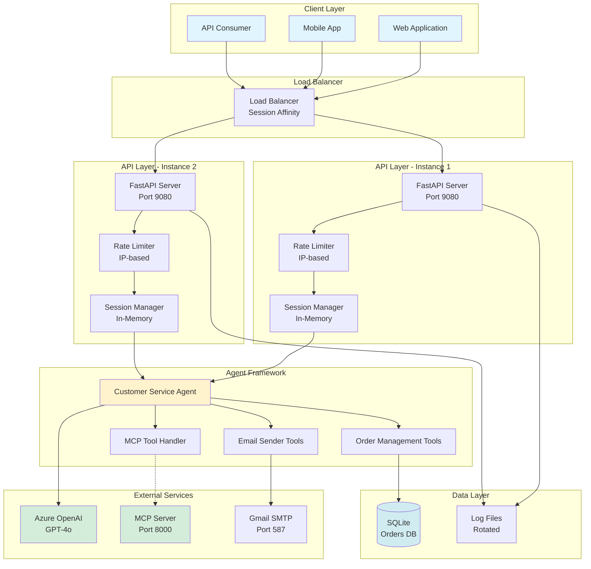

### Architecture Principles

1. **Stateless Design**: API servers maintain in-memory sessions but are stateless at infrastructure level
2. **Modular Components**: Clear separation of concerns (API, Agent, Tools, Config)
3. **Graceful Degradation**: MCP server unavailability doesn't prevent service startup
4. **Multi-tenancy**: Tenant isolation at session and data layers
5. **Observability**: Comprehensive logging with structured format

---

## System Components

### 1. API Server Layer

**Technology:** FastAPI + Uvicorn  
**Responsibility:** HTTP request handling, routing, validation

**Sub-components:**
- **Router**: Endpoint definitions and route handlers
- **Middleware**: CORS, rate limiting, request logging
- **Validators**: Request/response schema validation
- **Exception Handlers**: Global error handling

**Key Features:**
- Async/await for concurrent request handling
- Automatic OpenAPI documentation
- Pydantic models for data validation
- Server-Sent Events for streaming

### 2. Rate Limiter

**Algorithm:** Sliding window counter  
**Scope:** Per IP address  
**Storage:** In-memory (per instance)

**Configurable:**
- Enable/disable via environment variable
- Requests per minute threshold
- Exclusion patterns (health endpoints)

### 3. Session Manager

**Responsibility:** Conversation context management

**Features:**
- In-memory storage (dict-based)
- Multi-tenant session isolation
- Thread-safe operations
- Session lifecycle management

**Data Structure:**
```python
{
    "tenant_id:session_id": {
        "messages": [...],
        "created_at": datetime,
        "last_activity": datetime,
        "metadata": {...}
    }
}
```

### 4. Agent Framework

**Components:**
- **Agent Instance**: Singleton per API instance
- **Tool Registry**: Collection of available tools
- **Execution Engine**: Tool invocation and response generation

**Agent Configuration:**
```python
{
    "name": "CustomerServiceAgent",
    "model": "gpt-4o",
    "instructions": "...",
    "tools": [mcp_tool, *order_tools, *email_tools]
}
```

### 5. Tool Handlers

#### MCP Tool Handler
- **Type**: External service integration
- **Protocol**: HTTP streaming
- **Connection**: On-demand, with retry logic
- **Failure Mode**: Graceful degradation

#### Order Management Tools
- **Type**: Local Python functions
- **Database**: SQLite with SQLAlchemy ORM
- **Operations**: CRUD operations on orders
- **Validation**: Input validation using Pydantic

#### Email Sender Tools
- **Type**: Local Python functions
- **Protocol**: SMTP with TLS
- **Provider**: Gmail (configurable)
- **Features**: Text, HTML, attachments

### 6. Configuration Manager

**Responsibility:** Environment variable management

**Features:**
- .env file parsing
- Type validation and conversion
- Default values
- Sensitive data masking in logs

### 7. Logging System

**Responsibility:** Application logging

**Outputs:**
- Console (stdout)
- File (with rotation)

**Log Levels:** DEBUG, INFO, WARNING, ERROR, CRITICAL

**Format:** Structured JSON-like format with context

---

## Component Interactions

### Agent Initialization Flow

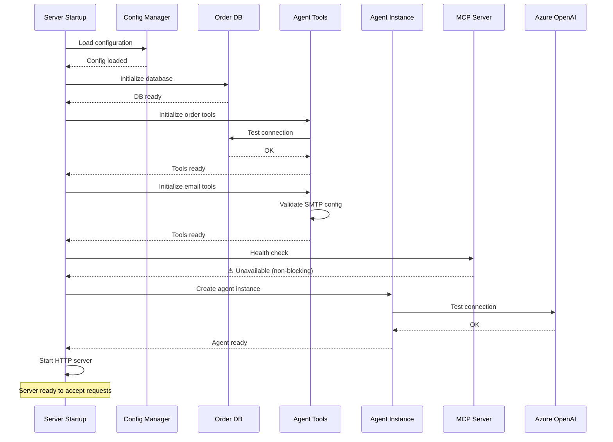

### Non-Streaming Chat Request Flow

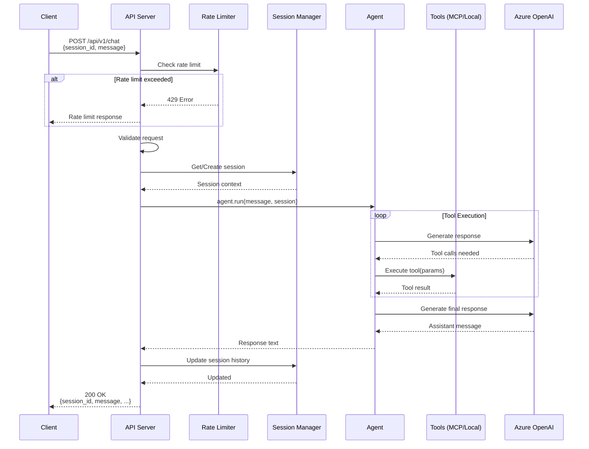

### Streaming Chat Request Flow

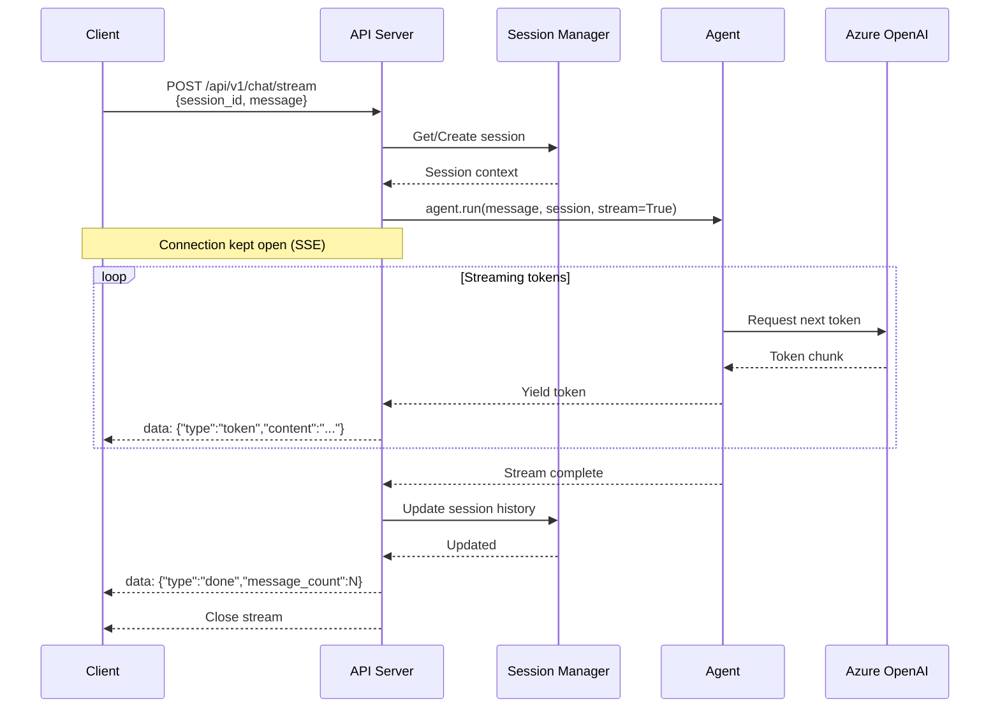

### Session Management Flow

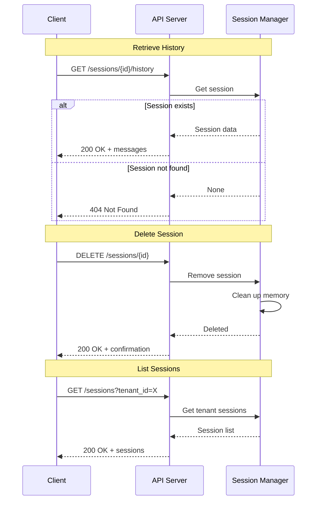

### Multi-Tenant Session Isolation

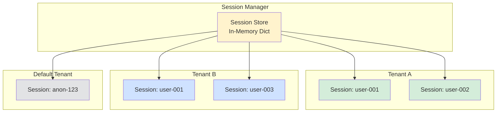

**Note:** Sessions with the same ID in different tenants (e.g., `user-001` in Tenant A vs Tenant B) are completely isolated and cannot access each other's data.

### Tool Execution Flow

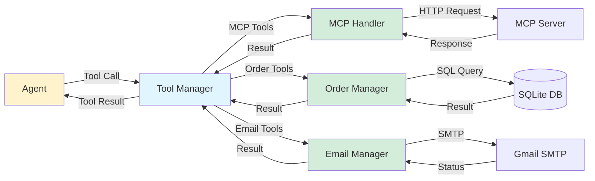

---

## Request Flow Diagrams

### Health Check Flow

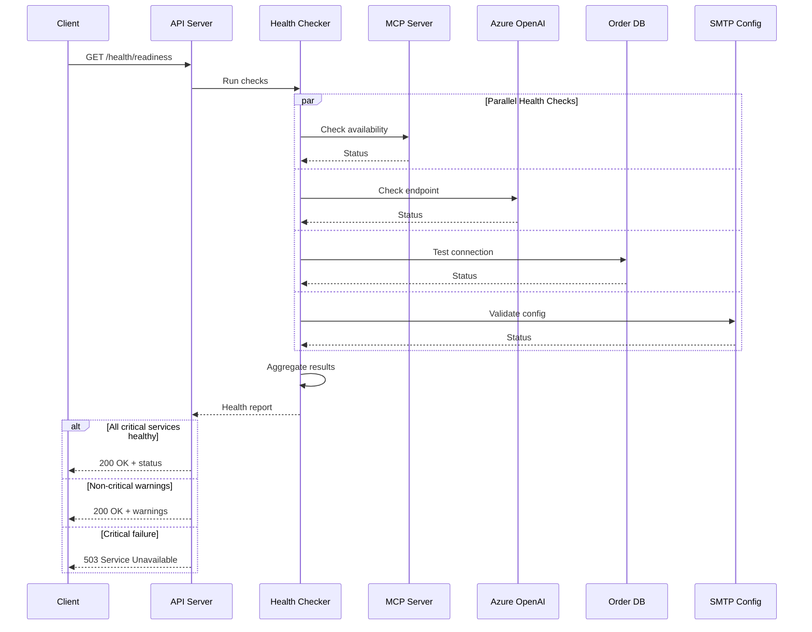

### Error Propagation Flow

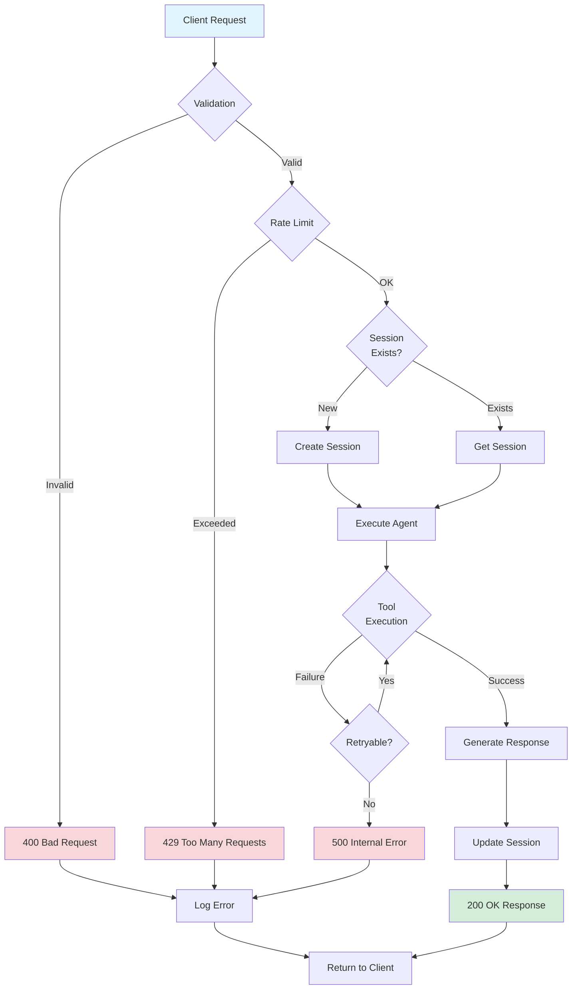

---

## Data Models

### Request Models

#### Chat Request
```python
class ChatRequest(BaseModel):
    session_id: str = Field(..., min_length=1, max_length=255)
    message: str = Field(..., min_length=1, max_length=10000)
    tenant_id: Optional[str] = Field(default="default", max_length=255)
    
    class Config:
        json_schema_extra = {
            "example": {
                "session_id": "user-abc-123",
                "message": "I need help with my order",
                "tenant_id": "company-001"
            }
        }
```

#### Chat Response
```python
class ChatResponse(BaseModel):
    session_id: str
    message: str
    timestamp: datetime
    message_count: int
    tenant_id: str
    request_id: Optional[str] = None
```

#### Stream Chunk
```python
class StreamChunk(BaseModel):
    type: Literal["token", "done", "error"]
    content: Optional[str] = None
    session_id: str
    message_count: Optional[int] = None
    error: Optional[str] = None
```

### Session Models

#### Session Data
```python
class SessionMessage(BaseModel):
    role: Literal["user", "assistant", "system"]
    content: str
    timestamp: datetime
    tool_calls: Optional[List[dict]] = None

class SessionData(BaseModel):
    session_id: str
    tenant_id: str
    messages: List[SessionMessage]
    created_at: datetime
    last_activity: datetime
    metadata: Dict[str, Any] = {}
```

#### Session Summary
```python
class SessionSummary(BaseModel):
    session_id: str
    tenant_id: str
    message_count: int
    created_at: datetime
    last_activity: datetime
```

### Health Check Models

#### Health Response
```python
class HealthCheck(BaseModel):
    status: Literal["healthy", "unhealthy", "degraded"]
    timestamp: datetime
    checks: Optional[Dict[str, str]] = None
    warnings: Optional[List[str]] = None
    uptime_seconds: Optional[int] = None
```

---

## Module Structure

### Project Directory Layout

```
v16-e2e/back-end/
├── server.py                  # Minimal entry point
├── requirements.txt           # Python dependencies
├── .env                       # Configuration (not in git)
├── .env.docker               # Docker configuration
├── .env.example              # Example configuration
├── .gitignore                # Git ignore rules
├── .dockerignore             # Docker ignore rules
├── Dockerfile                # Multi-stage Alpine build
├── docker-compose.yml        # Container orchestration
├── README.md                 # Documentation
├── CONTRIBUTING.md           # Contribution guidelines
├── CHANGELOG.md              # Version history
├── LICENSE                   # MIT license
│
├── app/                      # Main application code
│   ├── __init__.py           # App factory
│   ├── main.py               # FastAPI app creation
│   ├── dependencies.py       # Dependency injection
│   │
│   ├── api/                  # API layer
│   │   ├── __init__.py
│   │   ├── routes/           # Route handlers
│   │   │   ├── __init__.py
│   │   │   ├── chat.py       # Chat endpoints
│   │   │   ├── sessions.py   # Session management
│   │   │   ├── health.py     # Health checks
│   │   │   └── docs.py       # Documentation routes
│   │   ├── middleware/       # Middleware components
│   │   │   ├── __init__.py
│   │   │   ├── cors.py       # CORS configuration
│   │   │   ├── rate_limit.py # Rate limiting
│   │   │   ├── logging.py    # Request logging
│   │   │   └── errors.py     # Error handling
│   │   └── schemas/          # Pydantic models
│   │       ├── __init__.py
│   │       ├── chat.py       # Chat request/response
│   │       ├── session.py    # Session models
│   │       └── health.py     # Health check models
│   │
│   ├── agent/                # Agent framework
│   │   ├── __init__.py
│   │   ├── manager.py        # Agent lifecycle
│   │   ├── factory.py        # Agent creation
│   │   └── instructions.py   # Agent instructions
│   │
│   ├── tools/                # Tool implementations
│   │   ├── __init__.py
│   │   ├── mcp_handler.py    # MCP tool integration
│   │   │
│   │   ├── order_management/ # Order tools (copied from library)
│   │   │   ├── __init__.py
│   │   │   ├── operations.py
│   │   │   ├── database.py
│   │   │   ├── models.py
│   │   │   ├── validations.py
│   │   │   └── exceptions.py
│   │   │
│   │   ├── email_sender/     # Email tools (copied from library)
│   │   │   ├── __init__.py
│   │   │   ├── operations.py
│   │   │   ├── config.py
│   │   │   ├── validations.py
│   │   │   └── exceptions.py
│   │   │
│   │   └── wrappers/         # Tool to agent adapters
│   │       ├── __init__.py
│   │       ├── order_tools.py
│   │       └── email_tools.py
│   │
│   ├── session/              # Session management
│   │   ├── __init__.py
│   │   ├── manager.py        # Session CRUD
│   │   ├── store.py          # In-memory storage
│   │   └── models.py         # Session data models
│   │
│   ├── config/               # Configuration
│   │   ├── __init__.py
│   │   ├── settings.py       # Settings management
│   │   └── validation.py     # Config validation
│   │
│   ├── utils/                # Utilities
│   │   ├── __init__.py
│   │   ├── logger.py         # Logging setup
│   │   ├── exceptions.py     # Custom exceptions
│   │   └── helpers.py        # Helper functions
│   │
│   └── startup/              # Startup procedures
│       ├── __init__.py
│       ├── banner.py         # Welcome message
│       ├── checks.py         # Initialization checks
│       └── shutdown.py       # Graceful shutdown
│
├── data/                     # Data directory (gitignored)
│   └── orders.db             # SQLite database
│
├── logs/                     # Log directory (gitignored)
│   └── app.log               # Application logs
│
└── tests/                    # Test suite
    ├── __init__.py
    ├── conftest.py           # Pytest fixtures
    ├── test_api/
    │   ├── test_chat.py
    │   ├── test_sessions.py
    │   └── test_health.py
    ├── test_agent/
    │   └── test_manager.py
    ├── test_tools/
    │   ├── test_orders.py
    │   └── test_email.py
    └── test_session/
        └── test_manager.py
```

### Module Responsibilities

| Module | Purpose | Key Classes/Functions |
|--------|---------|----------------------|
| `server.py` | Entry point | `main()` |
| `app/main.py` | App factory | `create_app()` |
| `app/api/routes/` | HTTP handlers | Route functions |
| `app/api/middleware/` | Request/response processing | Middleware classes |
| `app/agent/manager.py` | Agent lifecycle | `AgentManager` |
| `app/tools/wrappers/` | Tool adapters | `@tool` decorated functions |
| `app/session/manager.py` | Session CRUD | `SessionManager` |
| `app/config/settings.py` | Configuration | `Settings` class |
| `app/utils/logger.py` | Logging | `setup_logger()` |
| `app/startup/banner.py` | Startup UI | `display_banner()` |

---

## Configuration Management

### Configuration Hierarchy

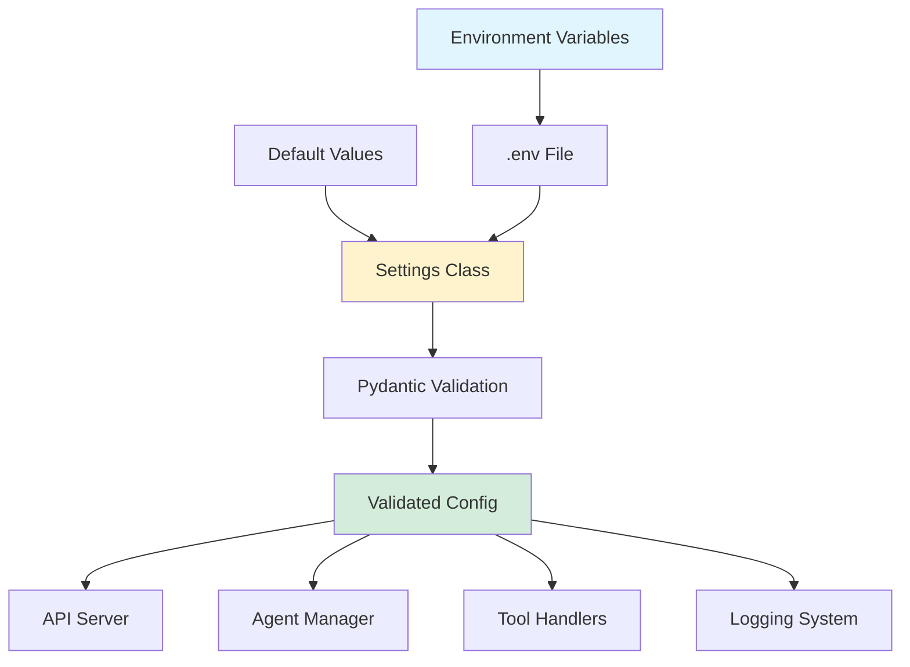

### Settings Class Structure

```python
class Settings(BaseModel):
    # Server
    SERVER_HOST: str = "0.0.0.0"
    SERVER_PORT: int = 9080
    LOG_LEVEL: str = "INFO"
    
    # CORS
    ENABLE_CORS: bool = True
    CORS_ORIGINS: str = "*"
    
    # Rate Limiting
    ENABLE_RATE_LIMITING: bool = False
    RATE_LIMIT_PER_MINUTE: int = 100
    
    # Azure OpenAI
    AZURE_AI_PROJECT_ENDPOINT: str
    AZURE_OPENAI_RESPONSES_DEPLOYMENT_NAME: str
    AZURE_OPENAI_API_KEY: str
    
    # MCP Server
    MCP_SERVER_URL: str = "http://localhost:8000/mcp"
    MCP_SERVER_REQUIRED: bool = False
    
    # Database
    ORDER_DB_PATH: str = "./data/orders.db"
    
    # Email
    SMTP_SERVER: str
    SMTP_PORT: int = 587
    SENDER_EMAIL: str
    SENDER_PASSWORD: str
    SENDER_NAME: str = "Customer Service"
    
    # Logging
    LOG_TO_FILE: bool = True
    LOG_FILE_PATH: str = "./logs/app.log"
    LOG_MAX_SIZE_MB: int = 100
    LOG_BACKUP_COUNT: int = 5
    
    class Config:
        env_file = ".env"
        case_sensitive = True
    
    def mask_sensitive(self) -> dict:
        """Return config with sensitive data masked"""
        ...
```

---

## Logging Architecture

### Log Flow

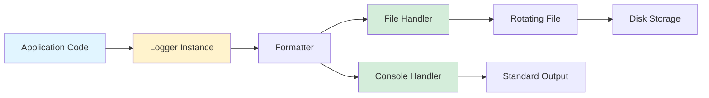

### Log Structure

```python
{
    "timestamp": "2026-02-19T10:30:45.123Z",
    "level": "INFO",
    "module": "app.api.routes.chat",
    "message": "User message received",
    "context": {
        "session_id": "abc-123",
        "tenant_id": "company-A",
        "request_id": "req-xyz-789",
        "ip_address": "192.168.1.100"
    },
    "extra": {}
}
```

### Logging Levels Usage

| Level | Usage | Examples |
|-------|-------|----------|
| DEBUG | Development debugging | Request payloads, variable values |
| INFO | Normal operations | Request received, session created |
| WARNING | Non-critical issues | MCP server unavailable, slow response |
| ERROR | Recoverable errors | Tool execution failure, validation error |
| CRITICAL | Service-impacting | Azure OpenAI unreachable, startup failure |

---

## Error Handling Strategy

### Error Hierarchy

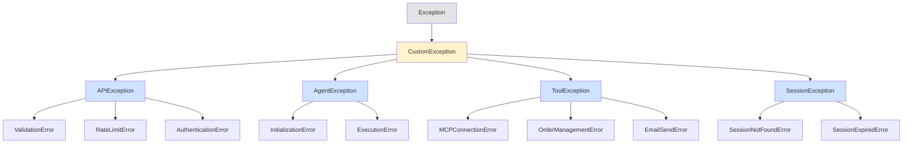

### Error Response Mapping

| Exception Type | HTTP Status | Error Message Format |
|----------------|-------------|---------------------|
| ValidationError | 400 | Field validation details |
| SessionNotFoundError | 404 | Session ID provided |
| RateLimitError | 429 | Retry-after header |
| ToolExecutionError | 500 | Generic error message |
| AgentInitError | 503 | Service unavailable |

### Retry Logic

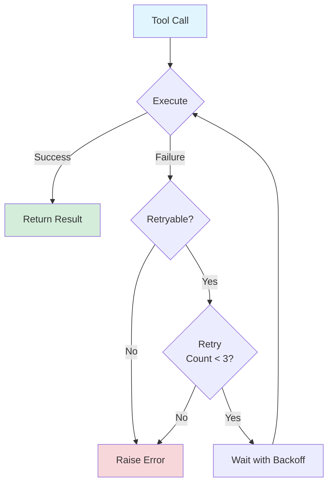

**Retryable Scenarios:**
- Network timeouts
- HTTP 503 from MCP server
- Transient Azure OpenAI errors

**Non-retryable Scenarios:**
- Validation failures
- Authentication errors
- Rate limit exceeded

---

## Scalability Considerations

### Horizontal Scaling Architecture

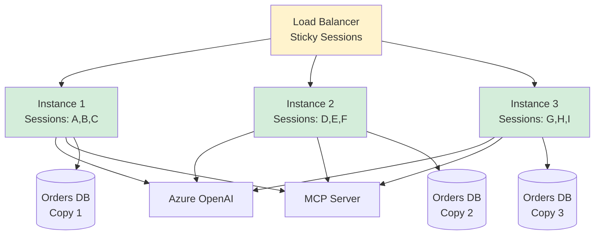

**Scaling Implications:**
- **Session Affinity Required**: Sessions are in-memory per instance
- **Stateless Operations**: No shared state between instances
- **Database**: Each instance has own SQLite (or shared DB for centralized orders)
- **Load Distribution**: Round-robin with sticky sessions

### Performance Optimization

**Async Operations:**
```python
# All I/O operations are async
async def handle_chat(request: ChatRequest):
    session = await session_manager.get_session_async(request.session_id)
    response = await agent.run_async(request.message, session)
    await session_manager.update_async(session)
    return response
```

**Connection Pooling:**
- Azure OpenAI client reuse
- MCP HTTP client with keep-alive
- Database connection pooling

**Caching Strategy (Future):**
- MCP tool schema caching
- Agent configuration caching
- Rate limit counter optimization

---

## Security Architecture

### Data Flow Security

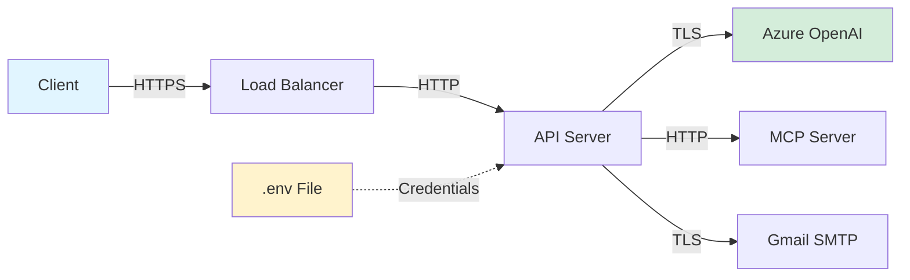

### Security Measures

**Transport Security:**
- HTTPS at load balancer (TLS termination)
- TLS for external services (Azure, SMTP)
- Internal HTTP within trusted network

**Credential Management:**
- Environment variables only
- No hardcoded credentials
- Sensitive data masked in logs

**Input Validation:**
- Pydantic schema validation
- SQL injection prevention (parameterized queries)
- XSS prevention (no HTML rendering)

**Rate Limiting:**
- DoS attack prevention
- Per-IP tracking
- Configurable thresholds

**Multi-tenant Isolation:**
- Tenant-specific session stores
- Query filtering by tenant_id
- No cross-tenant data access

---

## Deployment Architecture

### Docker Multi-Stage Build

```dockerfile
# Stage 1: Builder
FROM python:3.11-alpine AS builder
WORKDIR /build
COPY requirements.txt .
RUN pip install --user -r requirements.txt

# Stage 2: Runtime
FROM python:3.11-alpine
WORKDIR /app
COPY --from=builder /root/.local /root/.local
COPY app/ ./app/
COPY server.py .
ENV PATH=/root/.local/bin:$PATH
EXPOSE 9080
CMD ["python", "server.py"]
```

### Docker Compose Configuration

```yaml
services:
  api:
    image: msev15-e2e-service
    container_name: msev15-e2e-api
    env_file: .env.docker
    ports:
      - "${SERVER_PORT:-9080}:9080"
    volumes:
      - ./data:/app/data
      - ./logs:/app/logs
    restart: unless-stopped
    networks:
      - msev15-network

networks:
  msev15-network:
    driver: bridge
```

### Deployment Scenarios

#### Development
```bash
# Local development
uvicorn server:app --reload --port 9080
```

#### Production (Docker)
```bash
# Build image
docker build -t msev15-e2e-service .

# Run with compose
docker-compose up -d
```

#### Production (Kubernetes - Future)
- Deployment with 3 replicas
- Service with session affinity
- ConfigMap for configuration
- Secret for credentials
- Ingress for routing

---

## Appendix

### Technology Justification

| Technology | Justification |
|------------|---------------|
| **FastAPI** | Modern, async, automatic OpenAPI, high performance |
| **Uvicorn** | ASGI server, async support, production-ready |
| **Alpine Linux** | Minimal image size, security updates, fast builds |
| **SQLite** | Embedded, no separate service, sufficient for orders |
| **In-Memory Sessions** | Low latency, simple architecture, stateless scaling |
| **Pydantic** | Data validation, type safety, OpenAPI integration |

### Performance Benchmarks (Expected)

| Metric | Target | Notes |
|--------|--------|-------|
| Health endpoint | < 50ms | No external calls |
| Chat (non-streaming) | < 5s | Depends on AI model |
| Chat (streaming, first token) | < 2s | Time to first byte |
| Session retrieval | < 100ms | In-memory lookup |
| Concurrent sessions | 100/instance | Memory limit |
| Requests/sec | 50/instance | With rate limiting |

---

**Document Version:** 1.0  
**Last Updated:** February 19, 2026  
**Next Review:** Post Phase 2 Implementation  
**Maintainers:** Ramkumar, Rahul

